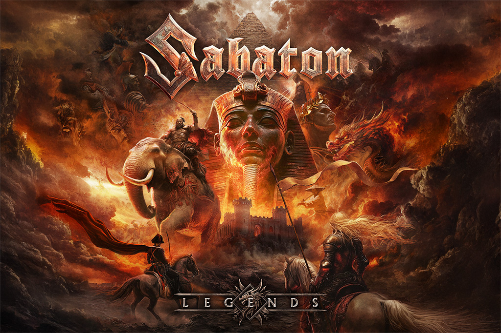

{.mx-auto .d-block .mb-5 .mw-100}

Le groupe suédois Sabaton s'apprête à frapper un grand coup avec la sortie de "Legends", leur onzième album studio prévu
pour le 17 octobre 2025. Fidèles à leur réputation de conteurs épiques de l'Histoire, les cinq musiciens franchissent
cette fois-ci un nouveau cap en remontant bien plus loin dans le temps que leurs précédents opus.

#### Un voyage dans l'Histoire ancienne

Avec "Legends", le groupe dépasse le champ de bataille de l'histoire militaire moderne pour voyager très loin dans le
passé. À travers 11 morceaux puissants, Sabaton donne vie aux figures les plus légendaires de l'Histoire : Jeanne d'Arc,
Napoléon Bonaparte, Jules César et le légendaire sabreur Miyamoto Musashi. L'album couvre également plusieurs événements
historiques marquants, incluant les Templiers durant les croisades, les invasions et conquêtes de Gengis Khan, et la
traversée des Alpes par Hannibal.

#### Une évolution naturelle pour le groupe

Joakim Brodén, leader emblématique du groupe, explique la genèse de cet album : "Les légendes ont toujours été tissées
dans notre musique, et l'album 'Heroes' en est le parfait exemple ! Je suis incroyablement fier de 'Heroes' et de tout
ce qu'il représente, donc 'Legends' est simplement la prochaine étape naturelle. C'est comme si l'histoire continuait,
mais en remontant très loin dans le temps."

Son compère Pär Sundström ajoute : "11 morceaux qui couvrent 11 histoires légendaires iconiques. Cette fois, nous
regardons plus loin dans l'histoire que ces dernières années, en allant à des époques que je trouve très excitantes. En
tant que passionné du Moyen Âge, des chevaliers et des légendes anciennes, c'était incroyable de finalement amener ces
histoires dans l'univers de Sabaton."

#### Tracklist et singles

Le premier single "Templars" est sorti le 25 avril 2025, suivi de deux autres titres dévoilés en juillet : "The Duelist"
et "Lightning at the Gates". Ces morceaux offrent un avant-goût de ce que le groupe décrit comme "une odyssée rock
inoubliable qui traverse le temps et les frontières, avec des riffs de guitare envolés, des chœurs qui donnent la chair
de poule et des refrains massifs".

#### Une sortie événement

L'album sera disponible dans divers formats physiques et exclusivités incluant des CD, un digibook 2 CD et un earbook 2
CD (tous deux incluant l'édition exclusive Storyteller), 11 éditions vinyle uniques au total (incluant une couleur
spéciale de vinyle et une pochette exclusive chacune), ainsi qu'un coffret limité.

Avec "Legends", Sabaton prouve une fois de plus sa capacité à transformer les pages poussiéreuses des manuels d'histoire
en hymnes de bataille retentissants. Les fans de power metal et d'histoire ont rendez-vous le 17 octobre pour ce qui
s'annonce comme l'un des albums les plus ambitieux du groupe suédois.

---

Tracklist :
01. Templars
02. Hordes Of Khan
03. A Tiger Among Dragons
04. Crossing The Rubicon
05. I, Emperor
06. Maid Of Steel
07. Impaler
08. Lightning At The Gates
09. The Duelist
10. The Cycle Of Songs
11. Till Seger
