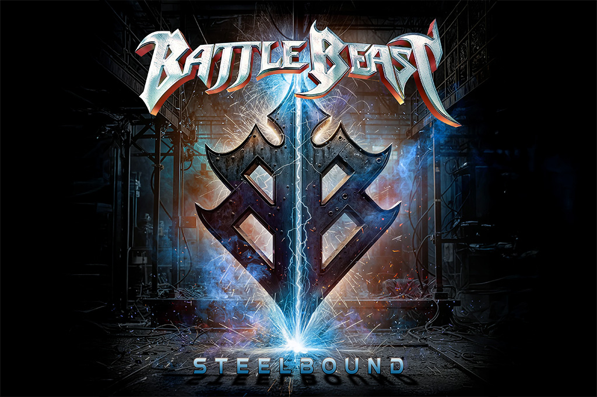

{.mx-auto .d-block .mb-5 .mw-100}

Le groupe de heavy metal finlandais Battle Beast prépare la sortie de son septième album studio, Steelbound, pour le 17
octobre 2025. L'album sera disponible sous différents formats, dont des vinyles colorés et une édition limitée incluant
un bonus CD nommé Discobound. Certains détaillants indiquent une date de disponibilité physique au 31 octobre 2025,
qui pourrait correspondre à la mise en vente dans certaines régions ou pour des formats spécifiques.

Produit par le label Nuclear Blast, Steelbound est présenté comme un chapitre excitant pour le groupe, qui y
fusionne heavy metal classique, hard rock aux accents des années 80, synthés cinématographiques et même des touches
d'énergie pop. Avec une durée de 38 minutes, l'album se veut un cri de ralliement pour les marginaux et une célébration
de la force intérieure.

#### Les singles et les thèmes de l'album

Pour construire l'attente, Battle Beast a dévoilé plusieurs singles qui donnent un aperçu de la variété et de la
puissance de l'album.



* Steelbound : le titre éponyme est un hymne thunderieux sur la défiance et la résistance. La chanteuse Noora Louhimo a
  partagé qu'elle puise son inspiration dans son expérience personnelle du harcèlement scolaire et du sexisme,
  faisant de ce titre un chant de lutte contre l'injustice.
* Here We Are : ce single est un anthem d'unité et de résilience. Le guitariste Joona Björkroth le décrit comme
  capturant ce moment après que la tempête soit passée — on a été testé, et on en ressort plus fort et plus sage.
* Angel of Midnight : plus récent, ce titre montre l'audace du groupe en s'aventurant vers un hard rock catchy, avec
  des influences revendiquées de Bon Jovi et de Def Leppard. Le bassiste Eero Sipilä a confié avoir eu un débat
  interne : Sommes-nous un groupe de heavy metal ? Puis il m'a frappé : Nous sommes Battle Beast—nous pouvons faire ce
  que nous voulons.
* Last Goodbye : pe premier single de l'album est un hommage à la force de l'esprit humain, inspiré par une
  rencontre avec une patiente courageuse dans un hôpital.

#### La voix puissante de Noora Louhimo

La charismatique chanteuse Noora Louhimo est saluée par la critique comme l'une des vocalistes les plus sous-estimées de
sa génération, passant avec une aisance déconcertante des cris puissants du power metal à un storytelling plus doux,
rappelant parfois Ann Wilson de Heart. Son interprétation et son vécu personnel imprègnent profondément les thèmes de
résistance et d'empowerment qui traversent Steelbound.

#### Une tournée européenne d'envergure

Pour célébrer la sortie de l'album, Battle Beast s'élancera dans une tournée européenne massive dès le 17 octobre 2025,
débutant par leur plus grand concert headliner en Allemagne à l'Inselpark Arena de Hambourg. La tournée s'étendra
jusqu'à la mi-décembre, traversant 13 pays avec pas moins de 40 dates. Les groupes Dominum et Majestica accompagneront
Battle Beast en tant qu'invités spéciaux et première partie, promettant une soirée mélodique et puissante.

Avec Steelbound, Battle Beast ne se contente pas de sortir un album ; il forge une expérience destinée à unir son
public. C'est un appel à se lever, à résister et à célébrer la force collective, le tout porté par un heavy metal aussi
mélodique qu'implacable.

---

Tracklist :

01. The Burning Within
02. Here We Are
03. Steelbound
04. Twilight Cabaret
05. Last Goodbye
06. The Long Road
07. Blood Of Heroes
08. Angel Of Midnight
09. Riders Of The Storm
10. Watch The Sky Fall
