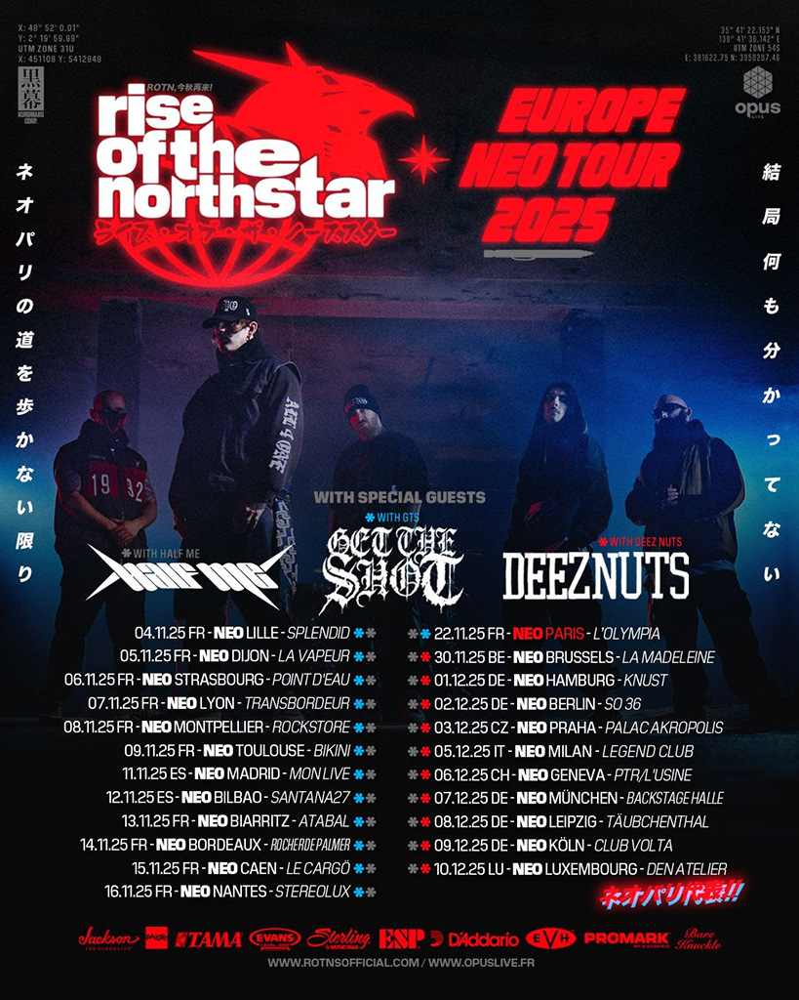

{.mx-auto .d-block .mb-5 .mw-100}

Les passionnés de rap-metal et de hardcore ont de quoi se réjouir. Rise Of The Northstar (ROTNS), formation emblématique
de la banlieue parisienne, annonce la sortie imminente de son quatrième opus intitulé "Chapter 4 : Red Falcon Super
Battle! Neo Paris War!!". Prévu pour le 14 novembre 2025 chez Kuromaku Corp Records, cet album s'annonce comme un
concentré d'énergie brute et de puissance sonore.

#### Un mélange explosif entre tradition et innovation

Composé de 13 titres percutants, ce nouvel opus promet de rester fidèle à l'ADN du groupe tout en apportant une
fraîcheur bienvenue. Comme l'explique le groupe : "Avec ce quatrième album, nous avons tenté de surprendre notre public
tout en restant fidèles à notre ADN, en apportant quelque chose de nouveau sans crucifier l'ancien." Cette approche se
traduit par un savant mélange de riffs puissants, de grooves envoûtants, de mélodies atmosphériques et de solos épiques.

#### Un processus créatif collaboratif

L'album a été enregistré entre le studio du groupe en banlieue parisienne et Marseille, avec la collaboration de Florent
Salfati de Landmvrks, qui a non seulement participé à la production mais apparaît également sur l'un des singles. Cette
dimension collaborative s'étend à d'autres artistes de la scène, notamment Aaron Matts de Ten56 qui prête sa voix sur le
morceau "Nemesis".

#### Des singles révélateurs

Trois singles ont déjà été dévoilés pour mettre l'eau à la bouche des fans : "Neo Paris", "Back 2 Basics" et "A.I.R.
Max". Ces morceaux donnent un aperçu de la direction musicale du groupe, entre modernité et références aux codes du
rap-metal old school. L'album ouvrira sur "Payback", un titre qui promet d'être dévastateur, tandis qu'un quatrième
single, "Falcon", devrait être dévoilé en octobre.

#### Une tournée européenne pour accompagner la sortie

Pour célébrer cette sortie, Rise Of The Northstar partira en tournée européenne headliner dès novembre 2025, offrant aux
fans l'opportunité de découvrir ces nouveaux morceaux en live, dans toute leur puissance scénique qui a fait la
réputation du groupe.

Avec "Chapter 4 : Red Falcon Super Battle! Neo Paris War!!", Rise Of The Northstar confirme son statut de formation
incontournable de la scène metal hardcore française, prête à conquérir de nouveaux sommets tout en restant ancrée dans
l'authenticité qui caractérise son identité musicale depuis ses débuts.

{.mx-auto .d-block .mt-5 .mw-100}

---

Tracklist :
01. Turbo-Intro
02. Payback
03. Neo Paris
04. Falcon
05. Back 2 Basics (ft. Landmvrks)
06. Under
07. Pressure
08. Nemesis (ft. Aaron Matts)
09. A.I.R. Max
10. Solitary Homeboy
11. No Turning Back
12. Desolation Hawk
13. 75 Outro
