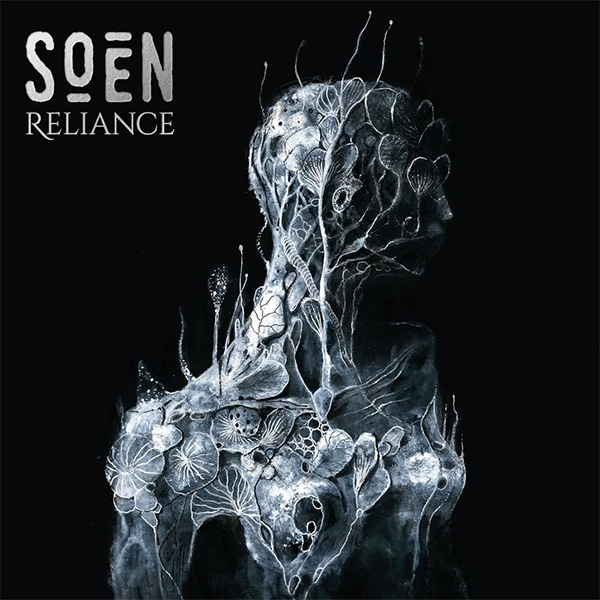

{.mx-auto .d-block .mb-5 .mw-100}

Le mastodonte suédois du metal progressif SOEN annonce la sortie de "Reliance", son septième album studio, prévu pour le
16 janvier 2026 via Silver Lining Music. Trois ans après "Memorial", le groupe mené par Joel Ekelöf au chant et Martin
Lopez à la batterie continue d'explorer les territoires émotionnels les plus profonds de l'âme humaine avec une vision
artistique toujours plus affirmée.

#### Une production irréprochable

L'album a été produit, enregistré et mixé par Alexander Backlund aux célèbres Fascination Street Studios, et masterisé
par Tony Lindgren. Ce choix de studio n'est pas anodin : les Fascination Street Studios sont réputés pour avoir
accueilli certains des plus grands noms du metal progressif et du rock alternatif, garantissant ainsi une qualité sonore
exceptionnelle.

#### Entre lumière et ténèbres

Avec "Reliance", SOEN continue de trouver de nouveaux chemins incroyables dans les espaces entre la lumière et
l'obscurité, le fort et le calme, le lourd et l'apaisant. Cette dualité constante, marque de fabrique du groupe, atteint
avec cet opus une nouvelle dimension de maturité artistique.

Avec sa marche fluide à travers un terrain émotionnel profondément humain, la musique de SOEN continue d'explorer l'
esprit, le cœur et l'âme humains avec un devoir de soin visionnaire, plus une dose supplémentaire de lourdeur. Le groupe
ne se contente pas de jouer du metal progressif : il crée des expériences émotionnelles immersives qui résonnent bien
au-delà du simple cadre musical.

#### "Primal" : un premier single explosif

Le premier single, "Primal", est un rugissement provocateur détaillant le combat existentiel entre l'esprit humain et
notre monde actuel, avec les incroyables voix d'Ekelöf menant la charge lourde.



Martin Lopez, batteur et membre fondateur du groupe (ancien batteur d'Opeth), commente : "'Primal' est une chanson qui
vient d'un lieu de frustration avec le monde dans lequel nous vivons. La corruption, la division et l'emprise suffocante
que la technologie a sur nous tous. C'est lourd et droit au but, construit sur des riffs et de l'énergie brute, mais
cela s'ouvre aussi sur un refrain qui semble plein d'espoir, comme un rappel que la lumière peut encore percer
l'obscurité."

Joel Ekelöf ajoute : "Pour nous, il ne s'agit pas seulement d'agressivité. Il s'agit d'encourager les gens à retrouver
ce feu, à se reconnecter avec la passion et à faire ces pas hors de l'obscurité ensemble."

#### Une exploration continue de l'humanité

Avec "Reliance", SOEN poursuit son exploration extraordinairement brute et sincère des limites mentales et physiques qui
défient l'humanité alors qu'elle se débat et lutte avec elle-même en ces temps difficiles. Réfléchi, provocateur, beau
et brutal, "Reliance" est un voyage que vous devez entreprendre.

Le groupe s'inscrit dans une tradition de metal progressif intelligent et émotionnellement chargé, où la technique
instrumentale est mise au service de l'expression artistique plutôt que de la démonstration gratuite. Cette approche,
héritée en partie de l'expérience de Martin Lopez avec Opeth, fait de SOEN l'un des groupes les plus respectés de la
scène prog metal actuelle.

#### Une tournée européenne pour accompagner la sortie

SOEN ne montre aucun signe de ralentissement et s'apprête à entreprendre 19 dates européennes lors du "Ultima Ratio Fest
2025" avec Dark Tranquillity, Equilibrium et Iotunn. La tournée débute le 24 septembre à Cologne, en Allemagne. Cette
tournée permettra aux fans d'avoir un avant-goût des nouveaux morceaux avant la sortie officielle de l'album en janvier.

#### Formats et précommandes

"Reliance" sera disponible en CD, album vinyl 12 pouces en versions noire et couleur, formats numériques et produits et
bundles spéciaux D2C. Les précommandes sont d'ores et déjà ouvertes, permettant aux fans les plus impatients de
sécuriser leur exemplaire de ce qui s'annonce comme l'un des albums prog metal majeurs de 2026.

Avec "Reliance", SOEN confirme son statut de pilier du metal progressif moderne. Entre introspection philosophique,
questionnements existentiels et puissance sonore maîtrisée, le groupe suédois continue de repousser les limites du genre
tout en restant profondément accessible et émotionnellement pertinent.

---

Tracklist :

01. Primal
02. Mercenary
03. Discordia
04. Axis
05. Huntress
06. Unbound
07. Indifferent
08. Drifter
09. Draconian
10. Vellichor
