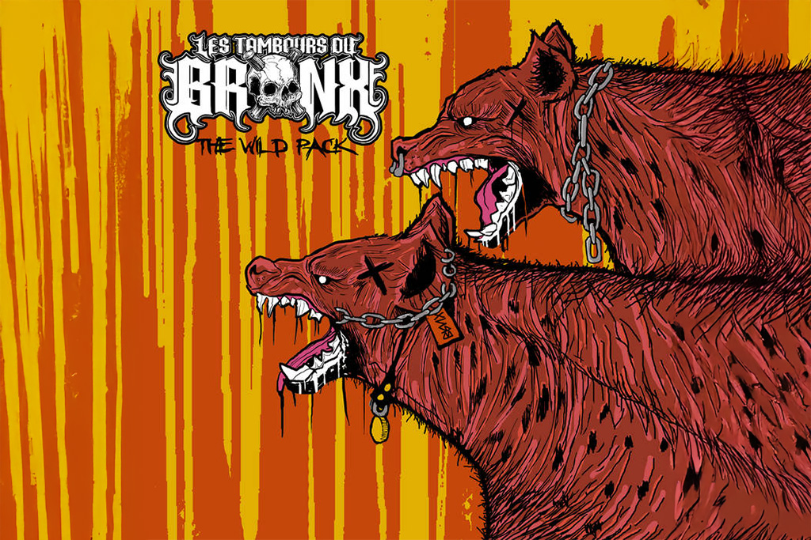

{.mx-auto .d-block .mb-5}

Deux ans après avoir marqué les esprits avec Evilution, Les Tambours du Bronx reviennent à la charge avec un nouvel EP
intitulé The Wild Pack. Prévu pour le 25 septembre 2025, ce disque six-titres promet une nouvelle déflagration sonore
dans l'univers de la percussion industrielle et du metal alternatif.

#### Une continuité visuelle et musicale

Ce disque six-titres s'inscrit comme une suite directe à leur précédent album, tant sur le plan visuel que musical. La
pochette, réalisée par Gary Ronaldson, prolonge l'univers graphique déjà amorcé avec Evilution : cette fois, les hyènes
de The Wild Pack viennent affronter les rhinocéros d'Evilution. Cette continuité thématique témoigne de la volonté du
groupe de développer un univers narratif cohérent à travers leurs sorties.

Comme l'explique le groupe : "Nous sommes heureux d'annoncer la sortie de The Wild Pack le 25 septembre prochain. Ce
nouveau chapitre de notre parcours rassemble six titres issus des sessions de notre album Evilution."

#### Six morceaux pour une expérience brute et tribale

The Wild Pack comprendra six morceaux, mélangeant inédits, versions alternatives et raretés.

Le titre « We Need Godz », déjà disponible sur la chaîne YouTube du groupe, donne un avant-goût de cette déflagration.
Les fans peuvent ainsi découvrir dès maintenant la puissance sonore qui les attend.

Parmi les moments forts de cet EP, « Jungle Jazz », morceau culte en live, bénéficie enfin d'une version studio après
des années à n'exister que sur la face B vinyle d'Evilution. Cette décision ravira les fans de longue date qui
réclamaient depuis des années une version enregistrée de ce titre incontournable de leurs concerts.

#### Une force de frappe industrielle unique

Les Tambours du Bronx sont un groupe français de percussion industrielle, formé en 1987 à Varennes-Vauzelles, dans la
banlieue de Nevers. Leur spectacle met en scène 18 musiciens entourés de sons synthétiques, de samples et de voix, avec
un usage massif du rythme. Le groupe joue une combinaison axée sur les percussions mêlant musique industrielle,
afrobeat, drum and bass, hip hop, rock, metal, hardcore et techno.

Leur identité metal s'est affirmée dès 2018, après une collaboration remarquée avec Sepultura. Cette évolution vers un
son plus agressif a permis au collectif de toucher un nouveau public tout en conservant son ADN percussif et tribal.

#### Un line-up stellaire

Cette nouvelle facette rassemble, en plus des quinze percussionnistes, des musiciens reconnus comme Reuno Wangermez,
Stef Buriez (Loudblast, Sinsaenum), Renato Di Folco (Dropdead Chaos, Trepalium), Franky Costanza (ex-Dagoba) et Arco
Trauma (Sonic Area). Cette concentration de talents issus de la scène metal française garantit une production et une
exécution irréprochables.

#### Une légende vivante de la scène mondiale

Référence mondiale des percussions industrielles, Les Tambours du Bronx ont donné plus de 1 300 concerts à travers le
monde : USA, Asie, Europe, Wacken, Times Square, Stade de France, Rock In Rio… Cette expérience scénique exceptionnelle
se ressent dans chaque note de leur musique, conçue avant tout pour être jouée live dans toute sa puissance
dévastatrice.

Les Tambours du Bronx défient les règles de la percussion, de l'industriel et du metal depuis plus de 35 ans. Des shows
live massifs, des rythmes tribaux et des riffs écrasants définissent leur son.

#### Rendez-vous à l'Olympia

En pleine tournée, Les Tambours du Bronx donneront un concert exceptionnel à l'Olympia le 11 octobre 2025, aux côtés de
Sidilarsen et Madam. L'occasion idéale pour découvrir sur scène l'énergie implacable de The Wild Pack. Ce concert
parisien dans l'une des salles les plus mythiques de la capitale promet d'être un moment d'anthologie pour tous les
amateurs de musique industrielle et de percussions déchaînées.

Avec "The Wild Pack", Les Tambours du Bronx confirment leur statut d'ovni indispensable de la scène alternative
française. Mêlant tradition et innovation, percussion tribale et metal industriel, le collectif continue de repousser
les limites du genre et de prouver que la musique française peut rivaliser avec les plus grandes formations
internationales.

---

Tracklist :

01. Whore
02. Am I Dead Enough
03. Echoes of Tomorrow
04. Jungle Jazz
05. Evilution
06. We Need Godz
