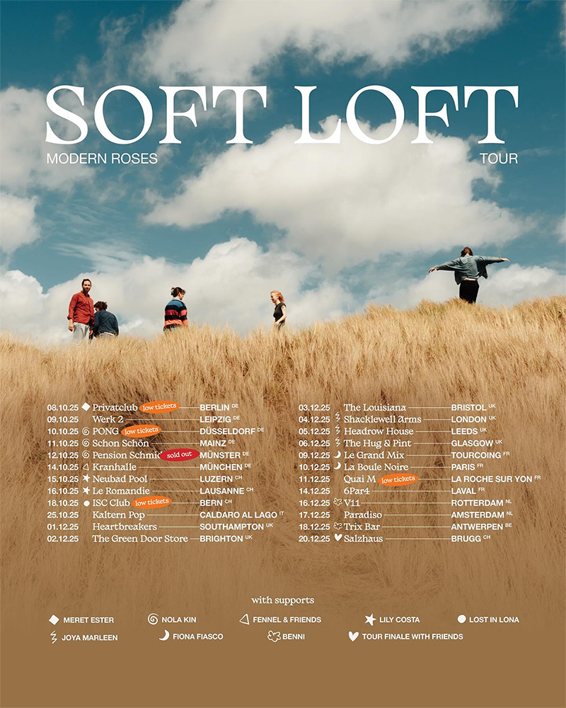

Le collectif indie folk suisse Soft Loft s'apprête à partir à la conquête de l'Europe avec sa tournée "Modern Roses",
qui débutera le 8 octobre 2025 au Privatclub de Berlin. Cette tournée marque une étape importante pour le groupe mené
par Jorina Stamm, qui poursuivra ainsi le succès de son premier album "The Party and the Mess" (2024) et de son récent
EP "Modern Roses" sorti en avril 2025.

{.mx-auto .d-block .mb-5 .mw-100}

#### Une tournée ambitieuse à travers le continent

La tournée "Modern Roses" promet d'être l'un des moments forts de l'automne indie européen. Soft Loft traversera
plusieurs pays du continent, offrant à ses fans l'opportunité de découvrir en live les nouveaux morceaux de l'EP ainsi
que les titres désormais cultes de leur premier album. Le groupe est particulièrement attendu en Allemagne, aux Pays-Bas
et au Royaume-Uni, où la scène indie folk a accueilli avec enthousiasme leur musique empreinte de vulnérabilité et
d'authenticité.

La date d'ouverture au Privatclub de Berlin revêt une importance particulière pour le groupe. Cette salle intimiste
berlinoise, connue pour avoir accueilli certains des plus grands noms de la scène indie alternative, offre un cadre
parfait pour l'atmosphère délicate et émotionnelle que Soft Loft cherche à créer lors de ses concerts. La capitale
allemande, véritable carrefour culturel européen, constituera une excellente rampe de lancement pour cette tournée qui
s'annonce mémorable.

#### L'EP "Modern Roses" comme fil conducteur

Cette tournée prend tout son sens dans le prolongement de la sortie de l'EP "Modern Roses", un projet de 6 titres qui
explore l'affection et les petits gestes que nous faisons pour réduire la distance entre nous. L'EP plonge également
dans toutes les magnifiques façons dont nous échouons : la solitude, le désir, la mauvaise communication, la prison du
soi, quitter quelqu'un et être quitté.

Le premier single "Leave The Light On", sorti en janvier 2025, a particulièrement bien fonctionné et sera sans doute
l'un des moments forts des concerts. Cette chanson incarne parfaitement la philosophie du groupe : transformer la
mélancolie quotidienne en espaces sûrs musicaux où la vulnérabilité devient une force.

#### Un concert qui promet une expérience immersive

Les concerts de Soft Loft sont bien plus que de simples performances musicales : ce sont de véritables expériences
émotionnelles. Le groupe se définit comme faisant de l'"Indie-something-something" et se sent aussi bien dans les clubs
intimistes bondés que sur les grandes scènes devant un océan de spectateurs. Cette polyvalence scénique leur permet de
créer une connexion unique avec leur public, quelle que soit la taille de la salle.

La formation complète comprendra Jorina Stamm au chant, accompagnée de Lukas Kuprecht à la batterie, Simon Boss à la
guitare et Marius Meier à la basse. Cette configuration leur permet d'explorer pleinement leur riche mélange de soft
pop, indie rock et éléments folk, créant une atmosphère à la fois mélancolique et lumineuse.

#### Une philosophie de la vulnérabilité

Comme le décrit le groupe : "Soft Loft est un refuge, une attitude, un mode de vie. C'est là où le brisé et l'imparfait
sont embrassés et célébrés. Soft Loft est l'endroit où la réalité se transforme en rêves et les rêves reviennent à la
réalité. Le jugement est suspendu ici. Parce que la vulnérabilité est la porte d'entrée vers la connexion."

Cette philosophie se ressent particulièrement lors des concerts live, où le groupe crée un espace sûr pour que le public
puisse se laisser aller émotionnellement. Les fans qui ont assisté à leurs précédents concerts, notamment au Montreux
Jazz Festival, témoignent régulièrement de l'intensité émotionnelle et de la beauté brute de leurs performances.

#### Des attentes élevées après un premier album remarqué

Le succès de "The Party and the Mess", sorti en mars 2024, a créé des attentes importantes pour cette tournée. L'album,
avec ses 12 titres incluant "Safe Space", "Summer Sadness", "Bathroom Floor" et "Happy New Year", a été salué pour sa
capacité à transformer des moments intimes en hymnes universels. Les fans pourront redécouvrir ces morceaux dans un
contexte live, où ils prennent souvent une dimension encore plus puissante.

Les morceaux comme "Joni", "Rose Colored" et le titre éponyme "The Party And The Mess" seront sans doute au programme,
offrant un équilibre parfait entre mélancolie et espoir, introspection et célébration.

#### Informations pratiques et billetterie

Les billets pour la tournée "Modern Roses" sont d'ores et déjà disponibles sur les plateformes habituelles. Compte tenu
de l'engouement autour du groupe et de la capacité souvent limitée des salles indie, il est fortement conseillé aux fans
de réserver leurs places rapidement.

La tournée se poursuivra tout au long de l'automne 2025, avec des dates qui seront progressivement annoncées. Les fans
peuvent suivre les actualités du groupe sur leur site officiel et leurs réseaux sociaux pour connaître l'intégralité du
calendrier de la tournée.

Avec cette tournée "Modern Roses", Soft Loft confirme son statut de révélation indie folk de ces dernières années. Le
groupe suisse prouve qu'il est possible de créer une musique profondément personnelle et vulnérable tout en touchant un
public toujours plus large. À partir du 8 octobre, l'Europe pourra découvrir ou redécouvrir la magie de Soft Loft dans
toute son intensité émotionnelle.
