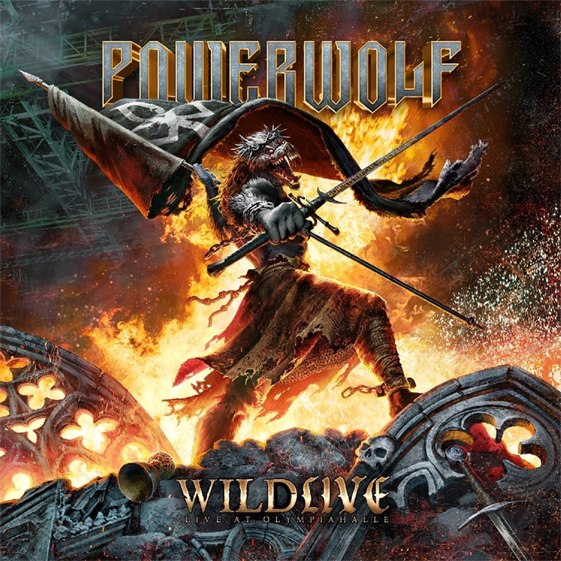

{.mx-auto .d-block .mb-5}

Les géants allemands du power metal Powerwolf s'apprêtent à graver dans le marbre l'un des moments les plus mémorables
de leur carrière avec la sortie de Wildlive (Live at Olympiahalle), prévue pour le 6 mars 2026 chez Napalm Records.
Cette publication multi-formats promet de capturer toute la magie, l'énergie et le génie théâtral du groupe lors de leur
plus grande tournée en tête d'affiche à ce jour.

#### Un concert historique capturé pour l'éternité

L'album live a été enregistré lors du concert à guichets fermés du 25 octobre 2024 à l'Olympiahalle de Munich, l'ultime
étape de la tournée Wolfsnächte Tour 2024. Ce show époustouflant marquait l'apogée d'une tournée européenne qui a vu le
groupe se produire dans les plus grandes salles du continent, de la Barclays Arena de Hambourg au Zenith de Paris, en
passant par l'AFAS Live d'Amsterdam et le Lotto Arena d'Anvers.

Comme l'explique le groupe : Nous avons toujours su qu'aucun mot ou résumé ne pourrait capturer ce que nous avons tous
ressenti lors de cette tournée. C'est pourquoi nous avons décidé d'enregistrer l'intégralité du show massif à guichets
fermés à l'Olympiahalle de Munich - pour préserver ne serait-ce qu'une partie de ce que nous avons tous vécu.



#### Un spectacle visuel et sonore sans précédent

Les concerts de Powerwolf sont réputés pour être bien plus que de simples performances musicales : ce sont de véritables
spectacles théâtraux. Colonnes de feu de plusieurs mètres de haut, effets lumineux éblouissants, mise en scène gothique
grandiose... Le groupe allemand ne fait jamais les choses à moitié. Wildlive promet de restituer fidèlement cette
expérience immersive qui a fait la réputation du quintet sur les scènes du monde entier.

La production de cet album live s'annonce exceptionnelle, avec un soin particulier apporté à la captation audio et vidéo
pour restituer au mieux l'atmosphère électrique de cette soirée munichoise. Les fans pourront revivre chaque instant de
ce concert légendaire, des hymnes incontournables aux nouveaux titres qui ont enflammé les foules lors du Wolfsnächte
Tour.

#### Une sortie multi-formats pour tous les fans

Conscient de la diversité de son public, Powerwolf proposera Wildlive (Live at Olympiahalle) dans une gamme
impressionnante de formats. L'album sera disponible en DVD et Blu-ray pour une expérience visuelle optimale, ainsi que
dans divers formats audio - vinyle, CD et téléchargement numérique - permettant à chacun de profiter de ce document
historique selon ses préférences.

Cette approche multi-formats témoigne de l'attention que porte le groupe à son public et de sa volonté de rendre
accessible ce moment d'exception au plus grand nombre. Les collectionneurs et les audiophiles trouveront leur bonheur
parmi les différentes éditions physiques, tandis que les formats numériques garantiront une diffusion mondiale
instantanée.

#### Un témoignage de leur domination

Avec Wildlive, Powerwolf consolide son statut de leader incontesté du power metal européen. Le groupe, qui enchaîne les
succès en tête des charts allemands depuis plusieurs albums, prouve une fois de plus sa capacité à transcender le simple
format studio pour offrir des expériences live mémorables.

Cette sortie intervient également dans un contexte particulièrement faste pour le groupe, qui a annoncé le Wake Up The
Wicked Tour 2026, une tournée européenne massive qui promet de repousser encore les limites du spectacle heavy metal.
Wildlive servira sans aucun doute de tremplin parfait pour cette nouvelle aventure, rappelant aux fans - nouveaux comme
anciens - pourquoi Powerwolf règne en maître sur les scènes européennes.

#### En attendant le 6 mars 2026

Les précommandes de Wildlive (Live at Olympiahalle) sont d'ores et déjà ouvertes sur les plateformes habituelles et le
site officiel du groupe. Pour ceux qui n'ont pas eu la chance d'assister à la Wolfsnächte Tour 2024, cet album
représente une opportunité unique de découvrir ou redécouvrir la puissance scénique de Powerwolf. Pour les autres, ce
sera l'occasion de revivre un moment d'exception et de posséder un morceau d'histoire du power metal allemand.

Avec Wildlive, Powerwolf ne se contente pas de sortir un énième album live : le groupe offre un testament sonore et
visuel de leur domination actuelle sur la scène metal européenne, capturant pour les générations futures ce qui fait de
leurs concerts des événements inoubliables.

---

Tracklist :

01. Bless’em With The Blade
02. Incense & Iron
03. Army Of The Night
04. Sinners Of The Seven Seas
05. Amen & Attack
06. Dancing With The Dead
07. Armata Strigoi
08. 1589
09. Demons Are A Girl’s Best Friend
10. Stossgebet
11. Fire And Forgive
12. We Don’t Wanna Be No Saints
13. Alive Or Undead
14. Heretic Hunters
15. Sainted By The Storm
16. Blood For Blood
17. Agnus Dei
18. Sanctified With Dynamite
19. We Drink Your Blood
20. Werewolves Of Armenia
