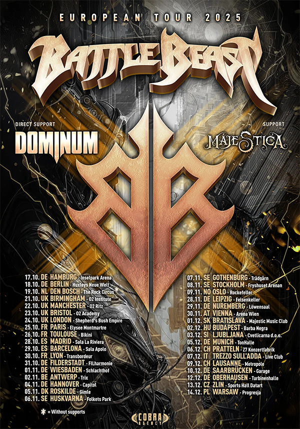

Les géants finlandais du power metal Battle Beast s'apprêtent à enflammer l'Europe avec une tournée monumentale qui
débutera le 17 octobre 2025 à l'Inselpark Arena de Hambourg, marquant ainsi leur plus grand concert headline en
Allemagne à ce jour. Cette tournée accompagne la sortie de leur septième album studio "Steelbound", également prévu pour
le 17 octobre via Nuclear Blast Records.

{.mx-auto .d-block .mb-5 .mw-100}

#### Un album puissant pour accompagner la route

"Steelbound" représente un nouveau chapitre incandescent dans l'épopée du groupe finlandais. L'album, qui continue de
raffiner le style inimitable de Battle Beast, délivre une collection de morceaux qui équilibrent puissance anthémique,
intensité mélodique et rugosité brute. Chaque chanson de l'album incarne la philosophie du groupe : ne faire aucun
compromis sur l'intensité tout en préservant la mélodie et l'émotion.

Le titre éponyme "Steelbound" est un hymne tonitruant de défi et de résilience, un cri de bataille chargé d'énergie pour
tous ceux qui ont déjà été rejetés, diminués ou réduits au silence. Comme l'explique le claviériste, producteur et
compositeur Janne Björkroth : "'Steelbound' est une chanson à la fois lourde et légère. Elle traverse les murs avec
fracas, tant en termes de composition que de paroles, sans oublier le groove et la petite étincelle dans l'œil."

La chanteuse Noora Louhimo ajoute une dimension personnelle : "Enfant, j'ai été victime de harcèlement à l'école, et en
tant qu'adulte, j'ai connu la misogynie et le sexisme dans ma vie professionnelle et privée. À travers toutes ces
expériences, je suis devenue une personne qui se bat toujours contre l'injustice. 'Steelbound' est une chanson de
pouvoir pour nous tous qui essayons de naviguer dans des situations de vie et des relations difficiles."

#### Une affiche de poids pour accompagner les Finlandais

La tournée ne sera pas un simple one-man show. Battle Beast s'entoure de deux groupes d'exception pour créer une soirée
de domination mélodique metal. Dominum rejoindra la tournée en tant qu'invité spécial, tandis que Majestica, la force
montante du power metal suédois, assurera les premières parties. Cette programmation tripartite promet des soirées
mémorables pour tous les amateurs de power metal européen.

#### Un parcours européen ambitieux

La tournée maintiendra Battle Beast sur les routes jusqu'à la mi-décembre, traversant l'Europe de long en large. Après
le coup d'envoi allemand à Hambourg, le groupe passera notamment par la France le 30 octobre au Transbordeur de
Villeurbanne, avant de poursuivre son périple à travers le continent.

La tournée se conclura avec quatre dates finlandaises en novembre : Oulu le 14 novembre au Tullisali, Helsinki le 15
novembre à l'Ice Hall (la même salle où a été enregistré leur album live "Circus Of Doom"), Turku le 20 novembre au
Logomo, et Tampere le 21 novembre à la Nokia Arena. Ces concerts dans leur pays natal promettent d'être particulièrement
intenses, le groupe jouant toujours avec une énergie décuplée devant son public local.

#### Un groupe au sommet de sa forme

Battle Beast est composé de Noora Louhimo au chant, Eero Sipilä à la basse, Joona Björkroth et Juuso Soinio aux
guitares, Janne Björkroth aux claviers, et Pyry Vikki à la batterie. Cette formation stable et soudée a su développer
une chimie scénique redoutable qui fait de chaque concert un moment d'exception.

Le groupe a surmonté plusieurs épreuves ces dernières années, notamment la rupture de l'artère carotide gauche de Noora
Louhimo révélée en novembre 2023, qui avait entraîné le report de leur tournée. Mais la chanteuse finlandaise, connue
pour sa voix puissante et sa présence scénique électrisante, est désormais complètement rétablie et prête à conquérir
l'Europe avec une énergie renouvelée.

#### Un spectacle à ne pas manquer

Battle Beast est reconnu mondialement pour ses performances live explosives qui transforment chaque concert en une
célébration épique du power metal. Leur show dystopique de type carnaval, capturé dans leur album live "Circus Of Doom -
Live in Helsinki 2023" sorti en avril dernier, démontre l'ampleur spectaculaire de leurs prestations scéniques.

Avec "Steelbound" et cette tournée européenne massive, Battle Beast prouve une fois de plus pourquoi ils sont considérés
comme l'une des exportations metal modernes les plus cohérentes d'Europe. Le groupe finlandais navigue avec aisance
entre heavy metal old-school et sonorités contemporaines, créant un son qui respecte les traditions tout en regardant
résolument vers l'avenir.

Les fans de power metal, de metal mélodique et de performances live spectaculaires ne voudront surtout pas manquer cette
tournée qui promet d'être l'un des événements metal majeurs de l'automne 2025.
