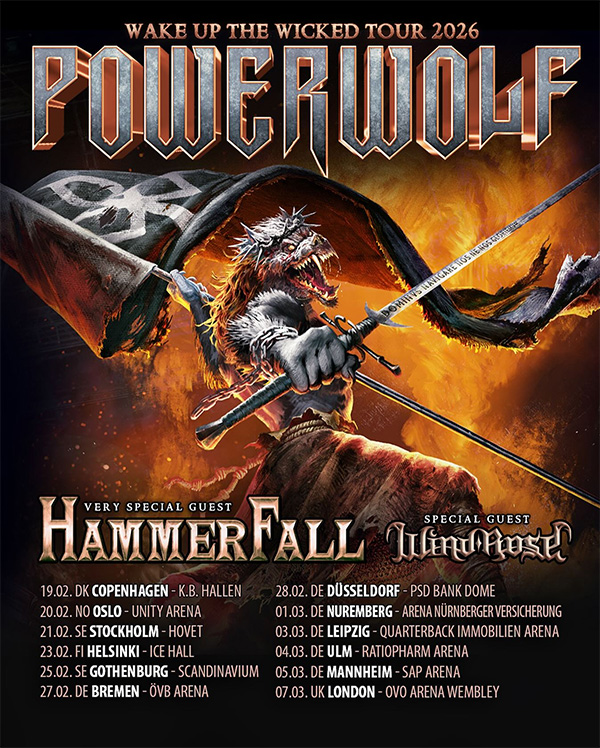

Les géants du power metal allemand Powerwolf ont dévoilé les détails de leur tournée européenne massive pour 2026,
baptisée "Wake Up The Wicked Tour". Du 19 février au 7 mars 2026, le groupe reviendra électriser les plus grandes arenas
du continent, accompagné de leurs frères de métal HammerFall en invité très spécial et Wind Rose en première partie.

{.mx-auto .d-block .mb-5 .mw-100}

#### Le succès des Wolfsnächte appelle une suite

Après le succès écrasant de leur tournée Wolfsnächte 2024, avec des arenas sold-out et des nuits inoubliables à travers
l'Europe, les fans réclamaient plus. Le groupe a répondu à l'appel avec cette nouvelle tournée qui s'annonce encore plus
ambitieuse. "Nous sommes ravis de dévoiler le Wake Up The Wicked Tour 2026 !", déclare le groupe. "Après le succès
écrasant de notre tournée Wolfsnächte 2024, beaucoup d'entre vous ont demandé plus. Et maintenant, vos appels ont été
entendus. Nous retournons dans plus de villes et nous serons rejoints une fois de plus par nos amis HammerFall et Wind
Rose."

Cette nouvelle tournée témoigne de la domination continue de Powerwolf sur la scène power metal européenne et de leur
capacité à remplir les plus grandes salles du continent. Le groupe, connu pour ses spectacles théâtraux spectaculaires
mêlant colonnes de feu, effets pyrotechniques massifs et mise en scène gothique grandiose, promet de repousser encore
les limites du spectacle heavy metal.

#### Un parcours européen impressionnant

La tournée débutera le 19 février 2026 à Copenhague au K.B. Hallen, avant de traverser la Scandinavie avec des étapes à
Oslo (Unity Arena, 20 février), Stockholm (Hovet, 21 février), Helsinki (Ice Hall, 23 février) et Gothenburg
(Scandinavium, 25 février).

Le périple se poursuivra ensuite en Allemagne avec des dates à Brême (ÖVB Arena, 27 février), Düsseldorf (28 février),
Mannheim (SAP Arena, 5 mars), avant de culminer avec un concert historique à Londres à l'OVO Wembley Arena le 7 mars
2026. Cette dernière date marque un moment particulièrement important puisqu'il s'agira de la toute première performance
de Powerwolf dans cette salle mythique.

D'autres dates devraient être annoncées prochainement, notamment en France et dans d'autres pays européens, pour
répondre à la demande massive des fans à travers le continent.

#### Une affiche de rêve pour les amateurs de power metal

Le choix de HammerFall comme invité très spécial n'est pas anodin. Les légendes suédoises du power metal, qui ont marqué
le genre depuis les années 90, apporteront leur expérience et leur énergie légendaire à cette tournée. La combinaison de
Powerwolf et HammerFall promet des soirées épiques où le heavy metal traditionnel sera célébré dans toute sa gloire.

Wind Rose, le groupe italien de power metal nain inspiré de l'univers de Tolkien, complètera cette affiche de rêve en
première partie. Leur mélange unique de power metal épique et de thématiques fantasy ajoutera une dimension
supplémentaire à ces soirées déjà extraordinaires.

Cette programmation tripartite garantit des soirées de plus de trois heures de power metal sans compromis, où les hymnes
anthémiques et les refrains massifs se succéderont dans une atmosphère de communion métallique totale.

#### Un album live pour patienter

En attendant le début de la tournée, Powerwolf sortira "Wildlive (Live at Olympiahalle)" le 6 mars 2026 via Napalm
Records. Cet album live capture la plus grande tournée headline du groupe à ce jour, enregistré lors du concert sold-out
de leur Wolfsnächte Tour 2024 à l'Olympiahalle de Munich.

Cette sortie permettra aux fans de revivre la magie de la tournée 2024 tout en se préparant pour l'expérience encore
plus monumentale qui les attend avec le Wake Up The Wicked Tour. L'album sera disponible en DVD, Blu-ray, vinyle et
formats numériques, offrant ainsi une documentation complète de l'un des spectacles les plus impressionnants de
l'histoire récente du power metal.

#### La sainte messe du heavy metal ressuscite

"Alors que les souvenirs de l'incroyable tournée nord-américaine sont encore frais, nous regardons déjà vers l'avenir",
annonce le groupe. "En 2026, la sainte messe du heavy metal ressuscitera à nouveau à travers l'Europe avec le Wake Up
The Wicked Tour."

Cette déclaration résume parfaitement l'approche de Powerwolf : chaque concert est conçu comme une célébration rituelle
du heavy metal, où le public n'est pas simplement spectateur mais participant actif d'une cérémonie rock grandiose. Les
thématiques religieuses détournées, la théâtralité assumée et l'énergie débordante du groupe créent une expérience
unique qui transcende le simple concert de metal.

#### L'héritage de Powerwolf continue de croître

Depuis leur formation, Powerwolf s'est imposé comme l'un des groupes de power metal les plus importants et les plus
constants d'Europe. Leur capacité à allier heaviness, mélodies accrocheuses et spectacle visuel époustouflant leur a
permis de construire une base de fans fidèles et toujours grandissante.

Le Wake Up The Wicked Tour 2026 représente l'aboutissement de plusieurs années de croissance constante, où le groupe est
passé de clubs intimistes à des arenas massives, tout en conservant l'intensité et la passion qui ont toujours
caractérisé leurs performances.

Avec le Wake Up The Wicked Tour 2026, Powerwolf prouve une fois de plus qu'ils sont les maîtres incontestés du spectacle
power metal en Europe. Entre pyrotechnie spectaculaire, hymnes anthémiques et une énergie scénique inégalée, le groupe
allemand s'apprête à offrir à ses fans une expérience qu'ils ne sont pas prêts d'oublier.
