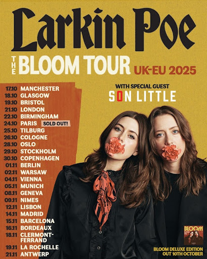

Le duo lauréat d'un Grammy entame sa tournée européenne le 17 octobre à Manchester.

Les sœurs Rebecca et Megan Lovell, qui forment le duo de blues rock Larkin Poe, ont lancé le 17 octobre 2025 leur
tournée européenne "The Bloom UK-EU Tour" à la Manchester Academy. Cette tournée très attendue marque le retour
triomphal en Europe du groupe lauréat d'un Grammy Award, qui vient célébrer le succès retentissant de leur septième
album studio "Bloom", sorti le 24 janvier 2025.

{.mx-auto .d-block .mb-5 .mw-100}

#### Un album au sommet des charts

"Bloom" s'est immédiatement imposé comme un nouveau jalon dans la carrière de Larkin Poe. L'album a rapidement grimpé
dans le Top 10 des charts Americana, passant quatre semaines dans le Top 5. Le single "Easy Love Pt. 1" a également
marqué les esprits sur les radios Americana à travers le pays, se maintenant 12 semaines dans le Top 10. Plus
impressionnant encore, "Bloom" a débuté à la première place du classement Billboard Top Blues Albums, confirmant la
domination du duo sur la scène blues contemporaine.

Cet album fait suite à "Blood Harmony" (2022), qui leur a valu leur premier Grammy Award dans la catégorie "Best
Contemporary Blues Album". Produit et co-écrit principalement par Megan, Rebecca et Tyler Bryant, "Bloom" voit Larkin
Poe s'aventurer plus loin dans leur voyage musical évolutif avec une collection de chansons qui résonnent d'
introspection, d'authenticité et d'une connexion profonde à leurs racines dans la musique américaine.

#### Une tournée européenne ambitieuse

Saluées comme l'un des groupes les plus travailleurs de la scène actuelle, Larkin Poe parcourra l'Europe et le
Royaume-Uni jusqu'à fin novembre avec des concerts dans de prestigieuses salles. La tournée traverse 12 pays avec des
étapes en France, aux Pays-Bas, en Allemagne, en Norvège, en Suède, au Danemark, en Pologne, en Autriche, en Suisse, au
Portugal, en Espagne et en Belgique.

Son Little, artiste multi-instrumentiste reconnu, accompagnera le duo en tant qu'invité spécial sur toutes les dates de
la tournée, promettant des soirées riches en émotions et en découvertes musicales.

#### "Bloom" : une célébration triomphante de l'authenticité

Rebecca Lovell explique la philosophie de l'album : "'Bloom' parle de se trouver soi-même au milieu du bruit du monde,
d'embrasser de tout cœur les défauts et les idiosyncrasies qui nous rendent réels. D'une manière ou d'une autre,
pratiquement toutes les chansons de cet album parlent de se trouver soi-même, de se connaître et de séparer la vérité de
qui vous êtes des attentes sociétales."

Cette introspection se retrouve dans des morceaux comme "Mockingbird", que Rebecca décrit comme "une tendre réflexion
sur le voyage perpétuel de devenir". Le morceau suit les singles "Bluephoria" et "If God Is a Woman", qui avaient été
dévoilés durant l'été 2024.

L'album marque une évolution significative pour Larkin Poe, reflétant une synergie qui s'étend au-delà d'un simple
partenariat musical. Déjà saluées pour la sincérité de leur composition, les sœurs Lovell mettent désormais encore plus
en lumière leur don pour la narration, plongeant profondément dans des récits personnels avec des thèmes universels
d'acceptation de soi et d'individualité, sur fond d'influences blues et rock contemporaines.

#### Une édition deluxe pour prolonger l'expérience

Pour célébrer le succès de "Bloom", Larkin Poe a sorti le 10 octobre une édition deluxe de l'album comprenant "An
Acoustic Companion Volume II", qui propose cinq versions acoustiques dépouillées de chansons du LP acclamé par la
critique. Cette sortie fait suite à "An Acoustic Companion" de 2023, qui avait rassemblé des versions acoustiques de
quatre favoris des fans.

Un pressage vinyle picture disc en édition limitée d'"An Acoustic Companion Volume II" et une version CD deluxe de "
Bloom" - avec une pochette alternative et les cinq nouvelles pistes - sont disponibles exclusivement en tournée et sur
la boutique en ligne officielle de Larkin Poe.

Le morceau focus de cette édition deluxe est "You Are The River", favori du groupe et des fans. Rebecca explique : "
Quand nous avons décidé de réinterpréter 'You Are The River' pour l'Acoustic Companion Vol II, nous voulions faire de
notre mieux pour laisser transparaître la tendresse et la vulnérabilité de la chanson."

#### Une reconnaissance critique unanime

"Bloom" a reçu les éloges critiques de médias prestigieux comme Rolling Stone, SPIN, Billboard, Forbes, Uncut, Guitar
World, Nashville Scene, No Depression, NPR, CLASH, Premier Guitar, Relix et Classic Rock. Le duo a marqué la sortie de
l'album avec des performances mémorables sur le Jimmy Kimmel Live! d'ABC et le Mountain Stage de NPR.

En mars 2025, Larkin Poe a été nommée ambassadrice américaine de la campagne EQUAL de Spotify, un honneur qui a vu le
duo apparaître sur un panneau d'affichage à Times Square à New York. Cette reconnaissance témoigne de l'impact croissant
du duo sur la scène musicale internationale.

#### Des musiciennes acclamées

Originaires de Géorgie et aujourd'hui basées à Nashville, Rebecca et Megan Lovell sont des multi-instrumentistes
accomplis. Rebecca est particulièrement reconnue pour sa maîtrise de la guitare slide, tandis que Megan brille au lap
steel et aux claviers. Leur mélange distinctif de lyrisme poétique, d'instrumentation magistrale et d'harmonies soul
affirme leur volonté de confronter les réalités actuelles tout en restant fidèles à leur héritage musical.

Le groupe a été nommé dans la catégorie "Duo/Group of the Year" aux 24èmes Americana Music Awards & Honors annuels à
Nashville. L'année dernière, le duo avait remporté les prestigieux honneurs "Duo/Group of the Year", ainsi que leur
premier Grammy Award pour "Best Contemporary Blues Album" pour "Blood Harmony".

#### Un avenir radieux

Au-delà de cette tournée européenne, Larkin Poe a un calendrier chargé pour les mois à venir. Le duo est prévu pour des
apparitions en tête d'affiche lors de plusieurs événements et festivals, notamment le Guitar Camp USA de Tommy Emmanuel
à Nashville (9-12 octobre), The Big Easy Cruise (18-25 janvier 2026, de Fort Lauderdale à la Nouvelle-Orléans et
Cozumel), le Sound Wave Beach Weekend de Joe Bonamassa à Miramar Beach (10-12 avril 2026), et le célèbre Stagecoach
Music Festival en Californie.

Avec "The Bloom UK-EU Tour 2025", Larkin Poe cimente pleinement son statut de porteuses de flambeau modernes de la
musique roots américaine, invitant leur public toujours croissant à s'épanouir et à prospérer à leurs côtés. Comme le
dit si bien le statement du groupe : "L'Histoire ne le souligne pas rapidement, mais le Rock 'n' Roll a été sous-tendu
par une racine matrilinéaire forte qui pousse profondément depuis des générations. Et maintenant, plus que jamais, cette
racine arrive à maturité."
