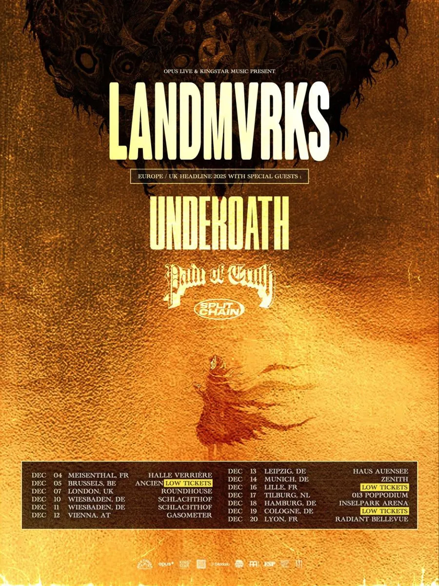

Le groupe marseillais débute le 4 décembre à Meisenthal avec une affiche explosive

Les champions français du metalcore LANDMVRKS s'apprêtent à clôturer une année 2025 exceptionnelle avec leur plus grande
tournée européenne à ce jour. Du 4 au 19 décembre, le quintet marseillais emmènera son album acclamé "The Darkest Place
I've Ever Been" sur les routes d'Europe, accompagné d'un line-up de choc : les légendes américaines Underoath, ainsi que
Pain Of Truth et Split Chain en soutien.

{.mx-auto .d-block .mb-5 .mw-100}

#### Une année 2025 monumentale

Cette tournée de décembre représente l'apogée d'une année extraordinaire pour LANDMVRKS. Après une tournée australienne
en mai, une série de dates estivales lors des plus grands festivals européens (Wacken Open Air, Summer Breeze Open Air,
Nova Rock Festival, Reload Festival), et une tournée nord-américaine headliner triomphale en septembre-octobre, le
groupe revient en Europe pour une dernière salve de concerts dans les plus grandes salles de leur carrière.

Composé du chanteur Florent Salfati, du bassiste Rudy Purkart, des guitaristes Nicolas Exposito et Paul C. Wilson, et du
batteur Kévin D'Agostino, LANDMVRKS a connu une ascension fulgurante qui culmine avec cette tournée dans des arenas et
grandes salles.

#### Un plateau d'exception

Le choix d'Underoath comme invité spécial n'est pas anodin. Les pionniers du post-hardcore américain, formés à Tampa en
Floride en 1997 et nommés aux Grammy Awards, apportent leur expérience de plus de 25 ans et leur réputation de
performances live incendiaires. Leur dixième album "The Place After This One" sortira prochainement, faisant de cette
tournée une occasion unique de découvrir leur nouveau matériel.

Pain Of Truth, formation hardcore explosive qui a récemment bénéficié du programme "Feed The Beat" de Taco Bell,
complète cette affiche de rêve aux côtés de Split Chain, groupe montant de la scène metalcore qui vient de sortir son
EP "motionblur" en juillet 2025 via Epitaph Records.

Cette programmation quadruple garantit des soirées de plus de trois heures de metalcore, hardcore et post-hardcore sans
compromis, où chaque groupe apportera sa propre énergie et son style distinct.

## Les dates de la tournée

L'Allemagne représente le cœur de cette tournée avec six concerts au total, confirmant le statut de LANDMVRKS comme l'un
des groupes metalcore les plus populaires outre-Rhin. La date du 18 décembre à l'Inselpark Arena de Hambourg marque un
moment particulièrement historique : il s'agit de la plus grande salle jamais jouée par le groupe en Allemagne.

16 décembre - Lille (France) @ L'Aeronef

Un retour en France avant la conclusion de la tournée, permettant aux fans français de célébrer avec leur groupe
national.

#### "The Darkest Place I've Ever Been" : un album qui a changé la donne

Cette tournée célèbre avant tout le succès retentissant de "The Darkest Place I've Ever Been", sorti le 25 avril 2025
via Arising Empire. L'album a propulsé LANDMVRKS vers de nouveaux sommets, leur permettant notamment de remporter les
trophées d'Artiste de l'année et d'Album de l'année lors de la première édition des Foudres, cérémonie dédiée au metal
français, le 9 octobre 2025 au Bataclan.

Décrit comme "un album intense qui unit émotions brutes, atmosphère sombre et breakdowns puissants", ce sixième opus du
groupe marque une évolution significative de leur son - plus dur, plus sombre et plus honnête que jamais. Le groupe y
traite de points bas personnels et de thématiques sociétales avec une énergie furieuse et une finesse mélodique
remarquable.

Les singles "Self Made Black Hole" (featuring Resolve), "Creature" et "Death" ont tous connu un succès important,
totalisant des millions d'écoutes sur les plateformes de streaming et consolidant la position du groupe comme fer de
lance du metalcore français.

#### Une tournée nord-américaine triomphale en préambule

Cette tournée européenne fait suite à une tournée nord-américaine headliner en septembre-octobre 2025, où LANDMVRKS
était accompagné de Thornhill, Silly Goose et Resolve. Les retours ont été unanimement positifs, avec des salles
sold-out et des critiques élogieuses sur l'énergie déployée par le groupe.

Un fan ayant assisté au show au Regent Theater de Los Angeles témoignait : "LANDMVRKS sont tout simplement un groupe
incroyablement talentueux. C'était notre deuxième fois cette année et ils sont devenus l'un de nos groupes préférés. La
portée vocale de Flo est phénoménale. Leur présence scénique est au top et leurs instrumentaux sont tout aussi
incroyables."

Cette tournée américaine a également permis au groupe de performer leurs collaborations live, notamment "Self-Made Black
Hole" avec Resolve et "Heretic" avec Novelists, créant des moments magiques qui seront sans doute reproduits lors de la
tournée européenne.

#### "La French touch" du metalcore

S'exprimant récemment dans les colonnes de Kerrang!, le bassiste Rudy Purkart a expliqué la recette du succès de
LANDMVRKS : "Nous avons la French touch. La France n'est pas un pays facile pour devenir un groupe de metal
professionnel, donc nous devons prouver que nous pouvons faire de bonnes choses."

Cette "French touch" se manifeste dans la capacité du groupe à mêler agressivité metalcore, mélodies accrocheuses et une
énergie live dévastatrice. Formé en 2014 à Marseille, LANDMVRKS a su s'imposer sur une scène internationale dominée par
les groupes anglo-saxons, prouvant que le metalcore français a toute sa place au sommet du genre.

#### Informations pratiques

Les billets pour la tournée "The Darkest Place I've Ever Been" sont disponibles sur Eventim, Ticketmaster et les sites
officiels des salles. Le presale exclusif Eventim a déjà commencé, avec le lancement de la vente générale fixé au 15 mai
à 11h00 CET.

Compte tenu de la popularité croissante de LANDMVRKS et de la présence d'Underoath à l'affiche, plusieurs dates
affichent déjà "Low Availability" (faible disponibilité), notamment la date londonienne au Roundhouse. Il est fortement
recommandé aux fans de sécuriser leurs places rapidement.

#### Une tournée qui promet d'être historique

Avec cette tournée de décembre 2025, LANDMVRKS franchit un nouveau palier dans leur carrière. Les salles choisies -
notamment l'Inselpark Arena de Hambourg et le Zenith de Munich - témoignent de l'ambition du groupe et de sa capacité à
remplir des arenas.

Pour les fans de metalcore, cette tournée représente un événement à ne manquer sous aucun prétexte. La combinaison de
LANDMVRKS au sommet de leur forme, d'Underoath apportant leur légendaire intensité post-hardcore, et de deux groupes
prometteurs en ouverture, garantit des soirées mémorables qui marqueront l'histoire du metalcore européen.

Comme le prouve leur ascension fulgurante - de petites salles marseillaises aux grandes arenas européennes en moins
d'une décennie - LANDMVRKS incarne parfaitement la vitalité et l'avenir du metalcore français. Et cette tournée de
décembre pourrait bien être le moment où le groupe cimente définitivement son statut de leader de la scène européenne.
