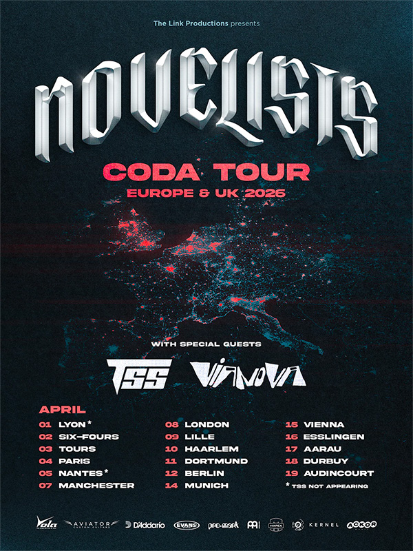

Le groupe français de metalcore progressif Novelists a officialisé une tournée européenne pour le printemps 2026,
baptisée "Coda Tour", en soutien à son cinquième album studio "Coda" sorti en mai 2025. Cette tournée prévoit pas moins
de 7 concerts en France, confirmant le statut du groupe comme l'un des fers de lance du metalcore hexagonal.

{.mx-auto .d-block .mb-5 .mw-100}

#### Paris à La Cigale : une date symbolique

Le concert parisien du 4 avril à La Cigale revêt une importance particulière pour le groupe. Cette salle mythique du
18ème arrondissement, réputée pour sa programmation rock et metal de qualité, représente une étape symbolique dans la
carrière de Novelists. Annoncée dans la foulée de la sortie de "Coda" sur le label ACKOR Music, cette performance
témoigne de l'ascension continue du groupe, aujourd'hui solidement installé parmi les figures du metalcore progressif
français.

La Cigale, avec sa capacité de 1 389 places et son acoustique réputée, offrira un cadre idéal pour découvrir l'énergie
et la technicité qui caractérisent les performances live de Novelists. Le concert débutera à 20h00 et promet une soirée
mémorable pour les fans parisiens.

#### Une affiche complète avec deux groupes émergents

Pour cette tournée, Novelists sera accompagné de The Sunday Sadness et Vianova, deux projets musicaux en pleine
ascension sur la scène metalcore et alternative française. Cette programmation tripartite garantit des soirées riches et
variées, permettant aux spectateurs de découvrir de nouveaux talents tout en profitant du show principal de Novelists.

Cette stratégie de soutien aux groupes émergents s'inscrit dans la philosophie de Novelists, qui a toujours cherché à
promouvoir la scène française et à créer une dynamique collective plutôt que de jouer uniquement la carte de la
compétition.

#### "Coda" : un album charnière

Paru le 16 mai 2025, "Coda" s'impose comme un album charnière dans la discographie de Novelists. Le groupe y déploie
toute sa maîtrise technique et sa maturité compositionnelle, mêlant riffs complexes, ambiances atmosphériques et
mélodies accrocheuses. L'album marque également la consolidation du line-up actuel avec Camille Contreras au chant, qui
a apporté une dimension nouvelle au son du groupe.

Le single "All For Nothing" a connu un démarrage remarquable, réalisant le meilleur démarrage de la carrière du groupe.
Ce morceau expérimental, que le groupe décrit comme "l'une des chansons les plus difficiles à écrire", démontre la
volonté de Novelists de repousser constamment les limites de leur créativité sans sacrifier leur identité sonore.

Camille Contreras elle-même a confié dans une interview : "Je pense que j'apporte une fraîcheur en tant que nouvelle
membre", soulignant l'importance de sa contribution au renouveau du groupe. Sa performance sur "Coda", qu'elle a chantée
en une seule prise face caméra pour une vidéo promotionnelle, a impressionné fans et critiques.

#### Un été festival bien chargé avant la tournée

Avant d'entamer le Coda Tour en avril 2026, Novelists aura déjà bien rodé son nouveau répertoire lors d'une série de
festivals prestigieux en 2025 :

- **22 juin 2025** : Hellfest (12h50 sur la Mainstage 2)
- Francofolies
- Graspop Metal Meeting (Belgique)
- Download UK (Royaume-Uni)
- Resurrection Fest (Espagne)

Ces performances estivales permettront au groupe de peaufiner son set et de créer l'anticipation nécessaire pour la
tournée européenne du printemps suivant. Le passage sur la Mainstage 2 du Hellfest, l'une des scènes principales du plus
gros festival metal français, témoigne de la reconnaissance dont jouit désormais Novelists sur la scène nationale et
internationale.

#### Une année 2025 de renouveau

L'année 2025 aura été marquée par un renouveau artistique important pour Novelists. Après des changements de line-up qui
ont jalonné leur histoire, le groupe semble avoir trouvé sa formation idéale et son identité définitive. La tournée
nord-américaine effectuée en septembre-octobre 2025 a reçu des retours extrêmement positifs, tant de la part des fans
que de la presse spécialisée.

Le groupe est désormais composé de :

- Camille Contreras (chant)
- Pierre Danel (guitare)
- Nicolas Delestrade (basse)
- Florestan Durand (guitare)
- Amael Durand (batterie)

Cette formation stable permet au groupe de développer une cohésion musicale remarquable, visible tant sur album qu'en
concert. La synergie entre les membres se ressent particulièrement lors des passages techniques complexes qui
caractérisent le style de Novelists.

#### De Paris aux scènes internationales

Formé à Paris, Novelists s'est imposé depuis sa création comme l'un des groupes les plus talentueux et ambitieux du
metalcore français. Leur approche progressive du genre, mêlant influences djent, metal atmosphérique et passages
mélodiques soignés, leur a permis de se démarquer dans un paysage saturé.

Le groupe a su construire sa carrière de manière méthodique, passant progressivement de petites salles parisiennes aux
grandes scènes nationales et internationales. Cette tournée du Coda Tour, avec son passage à La Cigale et ses dates dans
des salles de taille respectable à travers toute la France, confirme cette ascension constante.

#### Une dynamique portée par "Coda"

Cette nouvelle série de concerts s'inscrit dans la dynamique portée par "Coda", qui a reçu des critiques extrêmement
positives de la part de la presse spécialisée et des fans. L'album démontre que Novelists refuse la facilité et préfère
prendre des risques artistiques plutôt que de reproduire une formule gagnante.

Le groupe mélange technicité instrumentale, émotions brutes, atmosphères sombres et énergie pure dans un équilibre
maîtrisé qui fait désormais sa signature. Chaque morceau de "Coda" raconte une histoire, explore une facette différente
de la condition humaine et démontre une maturité compositionnelle remarquable.

#### Informations pratiques et billetterie

Les billets pour le Coda Tour 2026 sont déjà disponibles sur le site web officiel du groupe ainsi que sur les
plateformes de billetterie habituelles et les sites des salles concernées. Compte tenu de la popularité croissante de
Novelists et du succès de "Coda", il est fortement recommandé aux fans de réserver leurs places rapidement.

La date parisienne à La Cigale, en particulier, devrait afficher sold-out plusieurs semaines avant le concert, étant
donné la capacité limitée de la salle et l'importante base de fans du groupe dans la capitale et sa région.

#### Un groupe au sommet de son art

Avec le Coda Tour 2026, Novelists prouve qu'il est plus que jamais au sommet de son art. Après des années de travail
acharné, de tournées intensives et de remises en question créatives, le groupe parisien s'impose définitivement comme
une référence du metalcore progressif français et européen.

Cette tournée permettra aux fans de découvrir ou redécouvrir "Coda" dans toute sa puissance, avec la technicité
instrumentale, l'énergie scénique et l'émotion brute qui caractérisent les performances live de Novelists. Entre
passages atmosphériques intimistes et déferlantes de brutalité technique, le groupe offre une expérience live complète
qui ne laisse personne indifférent.

Pour les amateurs de metalcore progressif, ces 7 dates françaises représentent une opportunité unique de voir l'un des
meilleurs groupes du genre dans des conditions optimales. Ne laissez pas passer cette chance de participer à ce qui
pourrait bien être l'une des tournées metalcore françaises de l'année 2026.
