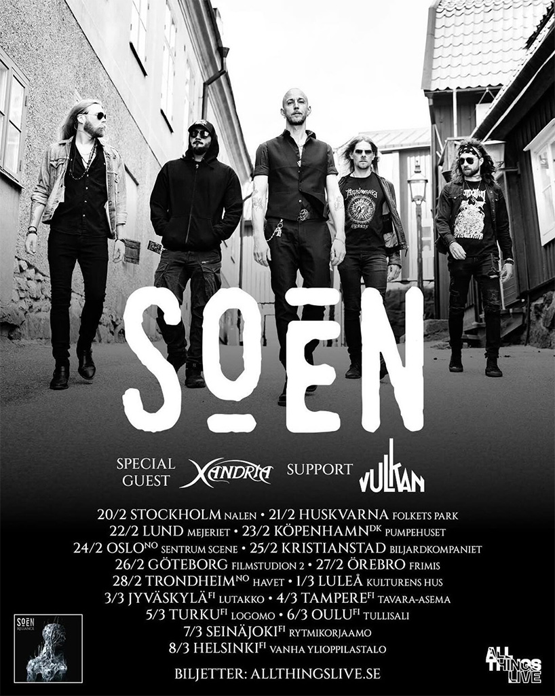

Il y a des groupes qu'on regarde grandir avec la satisfaction d'un jardinier patient. SOEN fait partie de ceux-là.
Depuis la sortie de *Cognitive* en 2012, la formation emmenée par l'ancien batteur d'Opeth, Martin Lopez, a tracé son
sillon avec une constance remarquable, album après album, tournée après tournée. Et 2026 s'annonce comme une nouvelle
étape dans cette ascension maîtrisée.

{.mx-auto .d-block .mb-5 .mw-100}

## Des fjords aux plaines européennes

La tournée débutera fin janvier avec le très prisé 70000 Tons of Metal, cette croisière métal légendaire au départ de
Miami où SOEN partagera l'affiche avec le gratin de la scène internationale. Mais c'est sur le sol scandinave que le
groupe donnera véritablement le coup d'envoi de sa campagne européenne.

Le Pumpehuset de Copenhague accueillera les Suédois le 23 février, suivi du Sentrum Scene d'Oslo le lendemain. La
tournée se poursuivra vers Trondheim le 28 février au Havet Djupet, puis direction la Finlande avec Oulu le 6 mars. Un
parcours nordique qui résonne comme un retour aux sources pour ce groupe profondément ancré dans l'ADN musical
scandinave.

## Un été de festivals

L'été 2026 verra SOEN multiplier les apparitions festivalières. Le Metalfest Open Air de Pilsen en République Tchèque
(5-7 juin), l'Alcatraz Metal Festival de Kortrijk en Belgique (6-9 août), le Summer Breeze de Dinkelsbühl en Allemagne
(12-15 août), et le Motocultor de Carhaix — ce dernier offrant aux fans français une opportunité précieuse de voir le
groupe sur leurs terres.

## L'héritage *Memorial*

Cette tournée s'inscrit dans la continuité du cycle *Memorial*, sixième album studio paru en 2023 qui a confirmé la
maturité artistique du groupe. Avec cet opus, SOEN s'est imposé comme une composante essentielle du prog metal moderne,
transcendant son statut initial de « supergroupe » pour affirmer une identité propre.

Sur scène, le quintet délivre généralement un set d'environ 1h15 mêlant les classiques comme "Lotus", "Martyrs" et
"Antagonist" aux morceaux plus récents. Une setlist qui traverse l'intégralité de leur discographie avec un équilibre
savant entre puissance et mélancolie, entre complexité rythmique et mélodie accessible.

## Pourquoi il faut y être

Les retours des concerts récents sont unanimes : SOEN possède une présence scénique exceptionnelle, chaque membre étant
un véritable maître de son instrument. Joel Ekelöf, dont le timbre évoque parfois celui de Maynard James Keenan, se
révèle encore plus impressionnant en live qu'en studio. Martin Lopez, architecte du projet, déploie une frappe d'une
précision chirurgicale sans jamais sacrifier l'émotion.

Contrairement à beaucoup de leurs contemporains, SOEN refuse les backing tracks et les artifices — juste du talent brut
et de la musique authentique.

Pour les fans de prog metal en quête d'authenticité, d'un son organique hérité de leur attachement légendaire à
l'enregistrement analogique, et d'une proposition artistique cohérente, les dates de 2026 représentent un rendez-vous à
ne pas manquer. SOEN reste l'un des groupes les plus sous-estimés de la scène progressive, mais plus pour longtemps.
