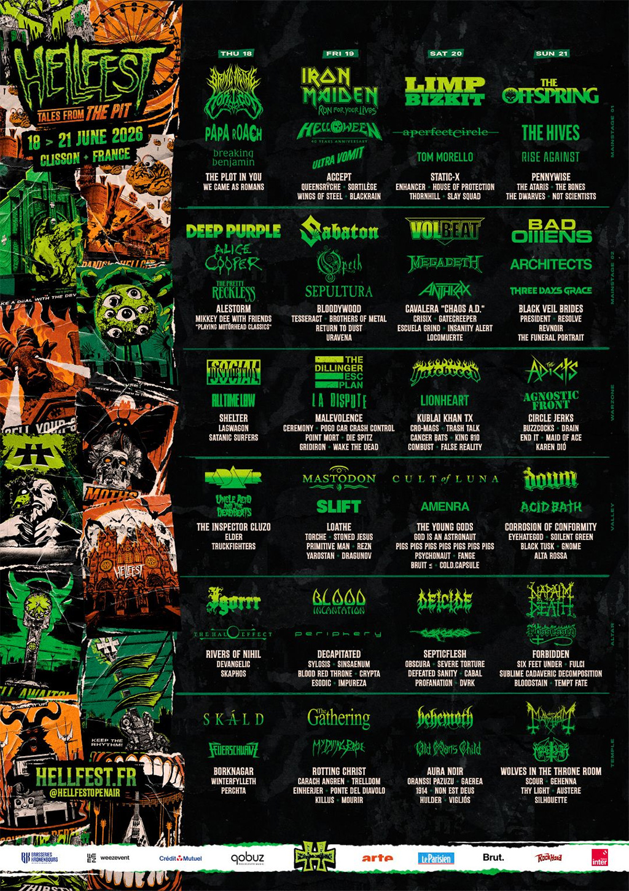

**Iron Maiden, Bring Me The Horizon, Limp Bizkit et The Offspring domineront les quatre journées du 18 au 21 juin à
Clisson**

Le plus grand festival metal d'Europe vient de dévoiler la programmation complète de sa 19ème édition. Du 18 au 21 juin
2026, le Hellfest Open Air accueillera pas moins de 183 groupes à Clisson, en Loire-Atlantique, pour quatre jours de
célébration des musiques extrêmes. Cette annonce, diffusée lors d'un livestream de 90 minutes, a immédiatement enflammé
la communauté metal mondiale.

{.mx-auto .d-block .mb-5 .mw-100}

#### Quatre têtes d'affiche pour quatre univers

L'organisation du Hellfest a frappé fort avec une programmation qui incarne "à la fois la montée d'une nouvelle
génération et le retour d'icônes légendaires". Les quatre têtes d'affiche illustrent parfaitement cette diversité :

**Jeudi 18 juin : Bring Me The Horizon**
Les Britanniques, fer de lance du metalcore moderne, ouvriront le festival en tête d'affiche. Le groupe d'Oli Sykes, qui
connaît actuellement un succès phénoménal avec sa série d'albums "Post Human", représente la nouvelle vague du metal
international. Leur performance promet d'être explosive, mêlant heaviness, électronique et mélodies accrocheuses.

**Vendredi 19 juin : Iron Maiden**
Les légendes britanniques célébreront leurs 50 ans de carrière avec leur tournée "Run For Your Lives", axée sur leurs
neuf premiers albums. Cette performance historique s'annonce comme l'un des moments forts de l'édition 2026, Iron Maiden
n'ayant cessé de prouver qu'ils restent au sommet de leur art après un demi-siècle d'existence.

**Samedi 20 juin : Limp Bizkit**
Le retour explosif des poids lourds du nu-metal en tête d'affiche marque un moment symbolique. Après des années
considérés comme un groupe du passé, Limp Bizkit connaît un regain de popularité spectaculaire, notamment auprès d'une
nouvelle génération. Fred Durst et ses comparses promettent un show dévastateur qui rappellera pourquoi ils ont marqué
leur époque.

**Dimanche 21 juin : The Offspring**
Les icônes californiennes du punk rock clôtureront le festival avec une journée spéciale punk rock sur la Mainstage 1.
Après plus de 40 ans de carrière, The Offspring continue de délivrer l'énergie et les hymnes qui ont fait leur légende,
de "Come Out and Play" à "Self Esteem".

#### 85 groupes en première au Hellfest

Parmi les 183 formations programmées, 85 se produiront pour la toute première fois sur les scènes du festival - un
record dans l'histoire du Hellfest. Cette statistique témoigne de la volonté de l'organisation de "célébrer l'énergie et
le renouveau de la scène" tout en restant fidèle à son identité.

Comme le souligne le communiqué officiel : "Notre programmation mélange plus que jamais légendes et découvertes", avec
une classification qui illustre la richesse de l'affiche :

**Les fondateurs :** Deep Purple, Alice Cooper, Accept

**Les nouvelles sensations :** Bad Omens, Blood Incantation, Bloodywood

**Les raretés :** Breaking Benjamin, A Perfect Circle

**Les hommages :** Megadeth, Sepultura, Cavalera Conspiracy

**La fierté française :** Ultra Vomit, Igorrr, BlackRain, Fange

**Les reformations attendues :** Acid Bath, The Dillinger Escape Plan

#### Une programmation foisonnante sur six scènes

Au-delà des têtes d'affiche, la programmation complète impressionne par sa diversité et sa qualité. Voici quelques-uns
des noms confirmés qui feront vibrer les six scènes du festival :

**Metal classique et légendes :** Anthrax, Helloween, Sabaton, Volbeat, Papa Roach, Opeth, Mastodon, Down, Carcass,
Deicide, Napalm Death, Behemoth, Mayhem, Sepultura

**Metalcore et hardcore moderne :** Architects, Hatebreed, Cancer Bats, Kublai Khan TX, Drain, Knocked Loose, End It,
Gatecreeper

**Nu-metal et rock alternatif :** Three Days Grace, Breaking Benjamin, Black Veil Brides, All Time Low

**Death et black metal :** Blood Incantation, Decapitated, Defeated Sanity, Devangelic, Carach Angren, Aura Noir,
Gehenna, Borknagar

**Punk et hardcore :** Social Distortion, Circle Jerks, Buzzcocks, The Adicts, Agnostic Front, Cro-Mags

**Progressif et atmosphérique :** A Perfect Circle, Cult Of Luna, The Gathering, God Is An Astronaut, Elder, Amenra

**Groupes français :** Ultra Vomit, Igorrr, BlackRain, Fange, Alta Rossa, BRUIT ≤, Bloodstain

#### Une programmation qui célèbre les femmes du metal

L'édition 2026 met particulièrement en avant la présence féminine dans le metal, avec plus de 42 musiciennes
programmées. Le vendredi sera notamment marqué par une journée spéciale "Women in Metal" sur la Mainstage 2, avec Within
Temptation, Heilung, Epica, Spiritbox, Kittie, Future Palace, Amira Elfeky, Charlotte Wessels et Sun.

Cette initiative témoigne de l'évolution du Hellfest et de la scène metal en général, qui reconnaît enfin pleinement la
contribution des femmes à tous les niveaux du genre.

#### Des reformations exceptionnelles

Deux reformations majeures marquent l'édition 2026 :

**Acid Bath**, le groupe de sludge metal louisianais culte, fera son grand retour après plus de 25 ans d'absence. Cette
reformation était attendue depuis des années par les fans de metal extrême et promet d'être l'un des moments les plus
émouvants du festival.

**The Dillinger Escape Plan**, pionniers du mathcore et du metal technique, reviendront également après leur séparation
en 2017. Leur performance promet d'être chaotique, technique et absolument mémorable, à l'image de leur réputation
scénique légendaire.

#### Une édition record qui s'annonce sold-out

Les pass 4 jours se sont écoulés en quelques minutes lors de leur mise en vente le 8 juillet 2025, avant même l'annonce
de la programmation. Cette vente record témoigne de la confiance que les festivaliers accordent au Hellfest et de son
statut de rendez-vous incontournable.

Une plateforme officielle de revente est disponible sur tickets.hellfest.fr pour ceux qui n'ont pas pu obtenir de pass
lors de la première vente. Les billets à la journée seront mis en vente au cours du premier trimestre 2026, date exacte
à annoncer.

#### Un festival qui continue de grandir

Depuis son lancement en 2006 avec 20 000 participants, le Hellfest n'a cessé de croître. L'édition 2025 a accueilli
environ 280 000 spectateurs sur les quatre jours, confirmant son statut de plus grand festival metal français et l'un
des plus importants au monde.

Le festival se déroule sur le site de Clisson, qui dispose de six scènes dans la zone de concert, plus des scènes
extérieures. Les décors, très élaborés, plongent les festivaliers dans un autre univers, particulièrement à la tombée de
la nuit. La Hell City Square, au cœur du festival, offre une promenade parmi les stands partenaires, une galerie
d'exposants et un immense marché metal avec des décors dignes des plus grands films de science-fiction.

#### Un anniversaire en vue pour 2027

L'organisation du Hellfest a tenu à préciser un point important : "2026 marque le 20ème anniversaire du tout premier
Hellfest, mais c'est en 2027 que nous célébrerons la 20ème édition (et vous savez que nous aimons les beaux
anniversaires...)." Cette distinction laisse présager une édition 2027 encore plus exceptionnelle pour célébrer ce jalon
historique.

#### Le rayonnement international du festival

Le Hellfest a été précédemment headliné par les plus grands noms du metal mondial : Metallica, Kiss, Guns N' Roses,
Slipknot, Black Sabbath, Judas Priest, Slayer, Motörhead, Aerosmith, Rammstein, Faith No More, Foo Fighters, Deftones,
Ghost, Tool, Nine Inch Nails et bien d'autres.

La programmation comprend généralement 90% de groupes internationaux et attire environ 20% de spectateurs étrangers,
confirmant son statut de festival européen majeur. Des festivaliers viennent de toute l'Europe et même du monde entier
pour assister à cet événement unique.

#### Informations pratiques

**Dates :** 18-21 juin 2026

**Lieu :** Clisson, Loire-Atlantique, France

**Capacité :** 60 000 personnes par jour

**Pass 4 jours :** Sold out - revente officielle sur tickets.hellfest.fr

**Billets à la journée :** En vente au premier trimestre 2026

Pour plus d'informations et pour consulter la programmation complète jour par jour, rendez-vous sur hellfest.fr.

#### Une playlist officielle sur Qobuz

Pour patienter jusqu'en juin 2026, le Hellfest a mis en ligne une playlist officielle sur Qobuz reprenant les titres les
plus emblématiques des 183 groupes programmés. Un excellent moyen de découvrir ou redécouvrir les artistes qui feront
vibrer Clisson dans 220 jours.

Avec cette programmation monumentale qui mélange générations, styles et nationalités, le Hellfest 2026 s'annonce comme
une édition historique qui confirmera, s'il en était besoin, le statut du festival comme référence mondiale des musiques
extrêmes. Entre légendes quinquagénaires et nouveaux phénomènes, entre death metal brutal et rock alternatif, entre
reformations cultes et découvertes prometteuses, il y en aura pour tous les goûts pendant ces quatre jours de
célébration du metal sous toutes ses formes.

Rendez-vous du 18 au 21 juin 2026 à Clisson pour une nouvelle édition légendaire !
