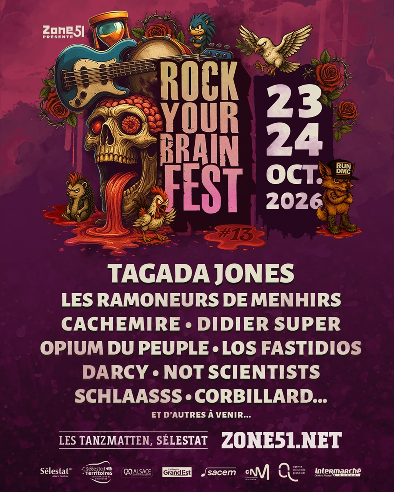

Après une édition 2025 survoltée qui a vu le samedi afficher complet, le Rock Your Brain Fest annonce déjà les premiers
noms de sa 13ème édition. Les 23 et 24 octobre 2026, les Tanzmatten de Sélestat vibreront à nouveau au son du rock, du
punk et du metal avec une programmation qui promet d'être aussi éclectique qu'explosive.

#### Une affiche qui mélange les genres

L'association Zone 51, organisatrice du festival depuis 2013, a dévoilé une première vague d'artistes qui reflète
parfaitement l'ADN du Rock Your Brain Fest : un mélange détonant de légendes du punk français, de groupes metal
underground et de formations décalées qui font la richesse de la scène alternative hexagonale.

{.mx-auto .d-block .mb-5 .mw-100}

**Les premiers noms confirmés :**

- **TAGADA JONES** : Les vétérans du hardcore punk français, connus pour leur militantisme sans concession et leur
  énergie dévastatrice sur scène
- **LES RAMONEURS DE MENHIR** : Le groupe breton qui mêle punk, metal et musique traditionnelle bretonne dans une fusion
  explosive et festive
- **CACHEMIRE** : Formation française de rock alternatif qui monte en puissance sur la scène nationale
- **DIDIER SUPER** : L'iconoclaste de la chanson française, humoriste et musicien qui décape tout sur son passage
- **OPIUM DU PEUPLE** : Le collectif engagé qui fusionne punk rock et chanson à texte avec une touche de provocation
  salutaire
- **LOS FASTIDIOS** : Les légendes italiennes du street punk/Oi! qui prônent l'antifascisme et la solidarité depuis plus
  de 30 ans
- **DARCY** : Formation française de metal/hardcore qui monte
- **NOT SCIENTISTS** : Le groupe punk rock français énergique
- **SCHLAASSS** : La formation alsacienne locale qui fait honneur à la scène régionale
- **CORBILLARD** : Le groupe au nom évocateur qui promet une performance mémorable

Et ce n'est qu'un début ! L'organisation promet d'autres annonces "très bientôt", laissant présager une affiche finale
aussi dense qu'excitante.

#### Un festival qui a trouvé son public

Créé en 2013 par l'association Zone 51, le Rock Your Brain Fest s'est imposé comme un rendez-vous incontournable de la
scène punk, rock et metal dans le Grand Est. Le festival propose traditionnellement deux journées thématiques : le
vendredi consacré au metal (progressive, Viking, melodic death metal) baptisé "Metal Day", et le samedi dédié au punk
baptisé "Disorder Day" (punk'n'roll, punk alternatif, protest punk).

L'édition 2025, qui affichait notamment Tankard, Ultra Vomit, Les Sheriff, Ludwig von 88 et Lion's Law, a connu un
succès retentissant avec un samedi complet plusieurs semaines avant le festival. Ce succès confirme la vitalité d'un
événement qui sait fédérer punks, metalheads, rockers et simples curieux dans une ambiance festive et sans prise de
tête.

#### Le cadre idéal des Tanzmatten

Les Tanzmatten de Sélestat, situées Quai de l'Ill, offrent un cadre idéal pour ce type de festival. Cette salle
polyvalente alsacienne permet une proximité avec les artistes tout en garantissant une qualité sonore optimale,
essentielle pour apprécier pleinement les riffs brutaux et les hymnes punk sans concession.

La configuration intérieure protège également le public des aléas météorologiques d'octobre tout en conservant une
atmosphère de festival avec ses différents espaces : grande salle pour les concerts, bars, stand de merchandising et
zones de rencontre.

#### Une philosophie festive et engagée

Au-delà de la musique, le Rock Your Brain Fest porte des valeurs fortes d'ouverture, de tolérance et d'engagement. La
programmation reflète cette diversité : du punk antifasciste de Los Fastidios au militantisme écologique et social de
Tagada Jones, en passant par l'humour décapant de Didier Super et la fierté culturelle bretonne des Ramoneurs de Menhir.

Le festival s'inscrit dans une démarche accessible avec une entrée gratuite pour les enfants jusqu'à 11 ans inclus,
permettant de transmettre la passion de ces musiques aux jeunes générations. Cette approche familiale, rare dans les
festivals punk et metal, témoigne de la volonté des organisateurs de démocratiser ces genres souvent victimes de
préjugés.

#### La billetterie ouvre bientôt

L'organisation prévient : "La billetterie ouvrira très bientôt — restez à l'affût, les premiers pass risquent de partir
aussi vite qu'un pogo enflammé !" Un conseil à suivre compte tenu du sold-out enregistré lors de l'édition 2025.

Les places seront disponibles sur zone51.net, le site officiel de l'association organisatrice. Comme chaque année,
plusieurs formules devraient être proposées : pass 2 jours, billets à la journée, et probablement des early bird pour
les plus rapides.

#### Un pilier de la scène alternative alsacienne

Le Rock Your Brain Fest s'inscrit dans un écosystème culturel alsacien particulièrement dynamique. L'association Zone
51, également connue pour son Z51 Fest estival (17-19 juillet 2026), œuvre toute l'année pour promouvoir les musiques
actuelles dans la région avec des studios de répétition, des formations, du conseil aux groupes et des actions de
prévention auditive.

Cette 13ème édition confirme la pérennité d'un événement devenu incontournable dans l'agenda des amateurs de musiques
alternatives. Entre têtes d'affiche reconnues et découvertes émergentes, entre punk historique et metal contemporain,
entre engagement politique et fête débridée, le Rock Your Brain Fest 2026 s'annonce fidèle à sa réputation : un week-end
où "on remet la cervelle dans le mixeur" !

Rendez-vous les 23 et 24 octobre 2026 aux Tanzmatten de Sélestat pour une nouvelle édition qui promet d'être mémorable.
D'autres annonces suivront dans les prochaines semaines pour compléter cette affiche déjà alléchante.
