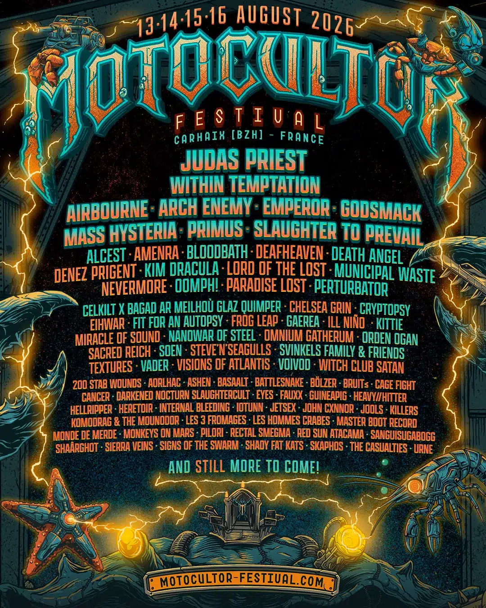

Le Motocultor frappe d'entrée. Le festival breton, installé à Carhaix depuis 2022 après des années passées à
Saint-Nolff, dévoile une première vague de noms pour son édition 2026 qui aura lieu du 20 au 23 août. Et le moins que
l'on puisse dire, c'est que la programmation s'annonce redoutable.

{.mx-auto .d-block .mb-5 .mw-100}

#### Opeth et Carcass en têtes d'affiche

Le festival confirme deux têtes d'affiche de poids. Opeth, les maîtres suédois du metal progressif, viendront célébrer
leurs trente ans de carrière sur la grande scène bretonne. Mikael Åkerfeldt et ses compères promettent un set
rétrospectif traversant l'intégralité de leur discographie monumentale, des classiques death metal de *Blackwater Park*
aux explorations progressives d'*In Cauda Venenum*.

Carcass, les pionniers du grindcore et du death metal mélodique originaires de Liverpool, compléteront ce duo de têtes
d'affiche. Le groupe de Jeff Walker, toujours aussi tranchant après plus de trente-cinq ans de carrière, apportera son
mélange unique de brutalité chirurgicale et de mélodies acérées.

#### La scène française à l'honneur

Le Motocultor confirme sa tradition de mise en avant des groupes français avec une sélection impressionnante. Igorrr, le
projet inclassable de Gautier Serre qui fusionne metal, musique baroque et breakcore, sera de la partie. Alcest, le
pionnier du blackgaze emmené par Neige, présentera les morceaux de son nouvel album "Aube". Celeste, le mastodonte du
post-hardcore lyonnais, et Regarde Les Hommes Tomber, les seigneurs du black metal nantais, complètent cette délégation
hexagonale de premier plan.

Déluge, formation bordelaise dont le post-black metal atmosphérique a conquis la critique, fera également le déplacement
en Bretagne.

#### Une programmation extrême et exigeante

Le Motocultor a toujours revendiqué une identité plus extrême que ses concurrents français. Cette édition 2026 ne déroge
pas à la règle avec la présence de Cult Of Luna, les Suédois dont le post-metal monumental est devenu une référence du
genre, et de Gaerea, le groupe portugais masqué dont le black metal atmosphérique a fait sensation ces dernières années.

Misþyrming, formation islandaise de black metal dont la réputation ne cesse de grandir, représentera la scène extrême
nordique sur les planches carhaisiennes.

#### Un festival en pleine croissance

Depuis son déménagement à Carhaix, le Motocultor a considérablement grandi, passant de huit mille à quinze mille
festivaliers par jour tout en conservant l'atmosphère conviviale et l'exigence musicale qui font sa réputation. Le
festival, qui partage le site du Vieilles Charrues, bénéficie désormais d'infrastructures de premier plan qui lui
permettent d'accueillir des têtes d'affiche internationales.

D'autres noms viendront compléter la programmation dans les semaines à venir. Les pass quatre jours sont d'ores et déjà
disponibles sur le site officiel du festival.
