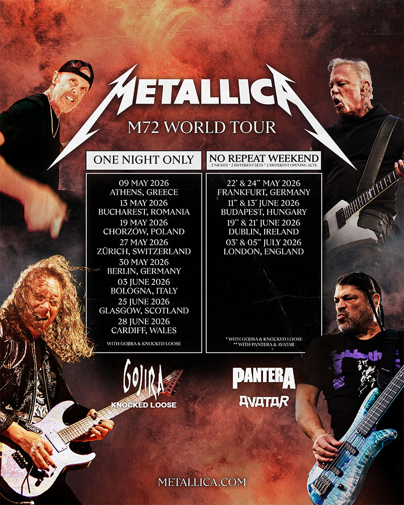

Le mastodonte ne s'arrête pas. Metallica annonce le retour de sa tournée M72 en Europe pour l'été 2026, avec un plateau
de support qui fait rêver : Gojira, Pantera, Knocked Loose et Avatar. Trois ans après le lancement de cette tournée
mondiale colossale, le groupe de James Hetfield et Lars Ulrich continue de dominer les stades du monde entier.

#### Des chiffres vertigineux

La tournée M72, lancée en avril 2023 pour accompagner la sortie de *72 Seasons*, a déjà généré plus de 517 millions de
dollars de recettes et attiré 4,23 millions de spectateurs sur 70 concerts. En 2024, le groupe a vendu 1,5 million de
billets sur la seule année, se classant parmi les dix tournées les plus lucratives au monde aux côtés de Taylor Swift et
Coldplay.

La tournée a remporté le prix de la "Rock Tour Of The Year" aux Pollstar Awards 2024. Le format innovant — deux concerts
dans chaque ville avec des setlists entièrement différentes — a été un succès commercial et artistique sans précédent.

{.mx-auto .d-block .mb-5 .mw-100}

#### Gojira en support : la consécration

Le choix de Gojira parmi les groupes supports confirme le statut du groupe français comme l'un des actes de metal les
plus importants de la planète. Après leur Grammy Award et leur prestation aux Jeux Olympiques de Paris 2024, les frères
Duplantier s'apprêtent à enflammer les stades européens aux côtés du plus grand groupe de metal de l'histoire.

Pantera, la reformation du groupe texan légendaire avec Zakk Wylde à la guitare et Charlie Benante à la batterie,
apportera sa brutalité groove metal au plateau. Knocked Loose et Avatar complètent une affiche éclectique qui couvre
tout le spectre du metal moderne.

#### Le M72 en quelques records

Parmi les moments marquants : un concert record de 47 319 personnes au JMA Wireless Dome de Syracuse en avril 2025,
battant un record vieux de 43 ans détenu par The Who, et une première au SoFi Stadium d'Inglewood devant près de 80 000
spectateurs.

La tournée se terminera le 5 juillet 2026 à Londres, marquant la fin de plus de trois ans de concerts dans les plus
grands stades du monde. Un monument du live qui confirme, si besoin était, la suprématie de Metallica sur la scène metal
mondiale.
