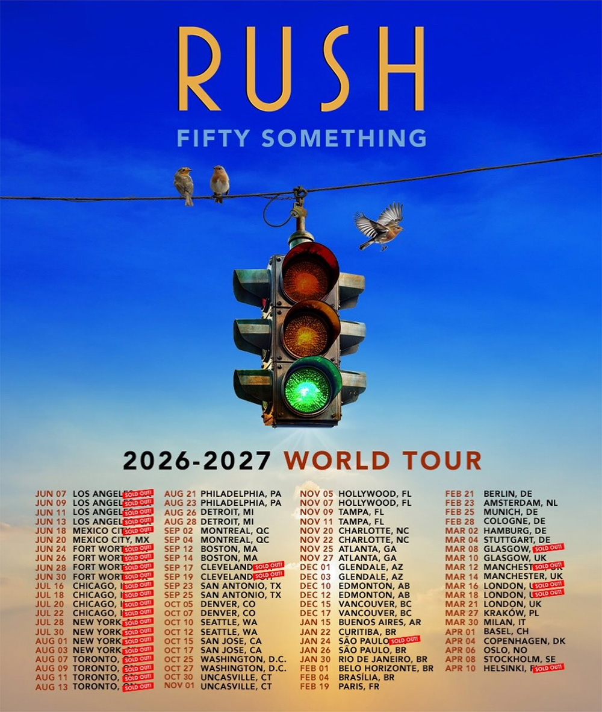

C'est l'un des retours les plus attendus de l'histoire du rock. Rush, absent des scènes depuis onze ans et endeuillé par
la disparition du légendaire batteur et parolier Neil Peart en janvier 2020, annonce que la tournée « Fifty Something »
est désormais complète. Geddy Lee et Alex Lifeson ont révélé aujourd'hui que Loren Gold assurera les claviers, aux côtés
de la batteuse Anika Nilles.

{.mx-auto .d-block .mb-5 .mw-100}

#### Un hommage plus qu'un remplacement

Les deux survivants de Rush ont toujours été clairs : il ne s'agit pas de remplacer Neil Peart, mais de célébrer son
héritage et la musique qu'ils ont bâtie ensemble pendant plus de quarante ans. La veuve de Peart, Carrie Nuttall-Peart,
et sa fille Olivia ont donné leur bénédiction au projet, dissipant les dernières réticences des fans les plus puristes.

Le choix d'Anika Nilles pour occuper le siège le plus intimidant du rock progressif n'est pas anodin. Ancienne batteuse
de Jeff Beck et artiste solo respectée avec quatre albums à son actif, la musicienne allemande apporte une technique
irréprochable et une sensibilité qui lui permettront d'honorer le répertoire sans chercher à le dupliquer.

#### Une demande qui dépasse toutes les attentes

La tournée a connu une expansion spectaculaire depuis son annonce initiale. Prévue à l'origine pour sept villes, elle
compte désormais 58 dates réparties sur 24 villes au Canada, aux États-Unis et au Mexique, après l'ajout de 17 puis
18 dates supplémentaires pour répondre à une demande sans précédent. Le périple débutera le 7 juin à l'Intuit Dome
d'Inglewood, en Californie, et traversera Los Angeles, Mexico, Fort Worth, Chicago, New York, Toronto, Philadelphie,
Detroit et Boston, entre autres.

#### Deux sets par soir

Geddy et Alex promettent deux sets complets par concert, offrant aux fans la possibilité de replonger dans un catalogue
qui couvre plus d'un demi-siècle de rock progressif — de *2112* à *Clockwork Angels*, en passant par *Moving Pictures*
et *Hemispheres*. Un format généreux qui témoigne de l'envie des deux musiciens de donner tout ce qu'ils ont à un public
qui les a attendus avec une fidélité remarquable.

#### Au-delà de l'Amérique du Nord

La tournée ne s'arrêtera pas là : selon les informations disponibles, les dates nord-américaines ne seront qu'un premier
chapitre, avec un passage par l'Europe prévu jusqu'en avril 2027, incluant Helsinki comme dernière étape connue à ce
jour. Rush n'a manifestement pas l'intention de faire les choses à moitié pour ce qui pourrait bien être le dernier tour
de piste.
