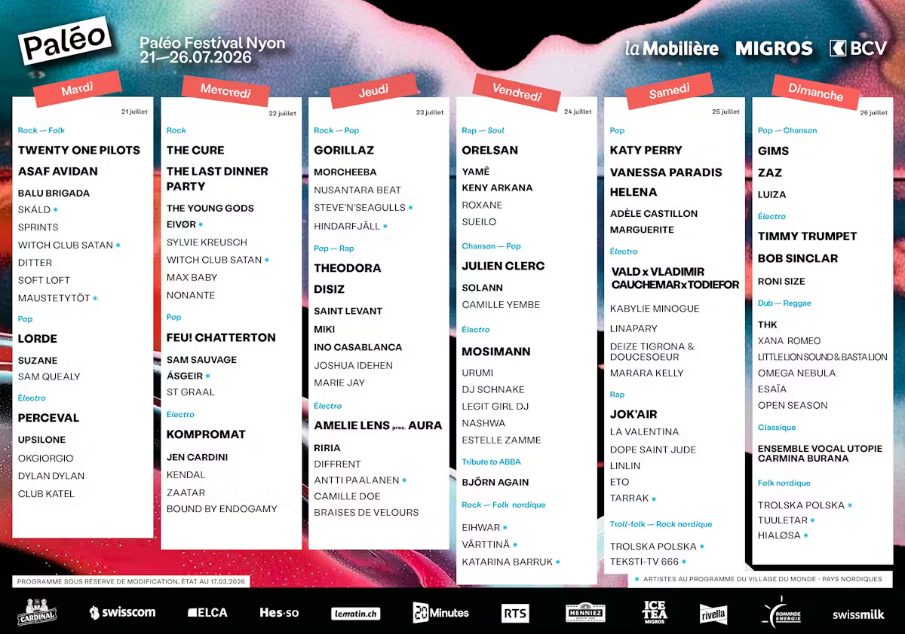

On le savait depuis l'été dernier : le Village du Monde mettrait le cap sur les pays nordiques. On devinait que
l'affiche, confiée cette année à la jeune créatrice genevoise Garance Allely (HEAD), donnerait le ton d'une édition
tournée vers l'exploration. Ce qu'on ne savait pas encore, c'est l'ampleur du casting que Daniel Rossellat et son équipe
avaient en réserve. La conférence de presse de ce mardi 17 mars, suivie en streaming par plus de 10 000 personnes, a
levé le voile sur une programmation qui s'annonce comme l'une des plus denses et des plus éclectiques de l'histoire du
festival nyonnais.

{.mx-auto .d-block .mb-5 .mw-100}

## Six jours, cinq scènes, tous les genres

La force de Paléo, depuis 49 éditions, est de faire cohabiter des univers que tout oppose — et cette année ne déroge pas
à la règle. Chaque soirée dessine son propre arc narratif, du rock introspectif à l'électro cataclysmique, de la chanson
française ciselée au rap de stade.

**Le mardi 21 juillet** pose d'emblée les fondations rock-folk de la semaine. Twenty One Pilots, dont le tube « Stressed
Out » dépasse les 3 milliards de vues sur YouTube, font leur retour sur l'Asse après leur passage de 2019. Asaf Avidan,
absent du festival depuis treize ans, retrouve la Plaine avec sa voix androgyne et incandescente. La pop néo-zélandaise
de Lorde — première venue au Paléo, unique concert suisse de l'été — et l'électro à heaume de Perceval complètent une
ouverture qui donne le ton.

**Le mercredi 22 juillet** sera celui de la guitare. The Cure reviennent officier leur messe noire, sept ans après leur
dernier passage. À leurs côtés, The Last Dinner Party — le phénomène glam rock londonien dont le concert zurichois du
mois dernier a affiché complet — et The Young Gods, légendes helvétiques qui célèbrent quarante ans de carrière avec un
cinquième passage au festival. Feu! Chatterton et Kompromat (le projet électro de Rebeka Warrior et Vitalic) apporteront
la touche francophone et la sueur électronique de la soirée.

**Le jeudi 23 juillet** est probablement la soirée la plus stratosphérique de l'édition. Gorillaz, portés par leur
récent album « The Mountain », occuperont la Grande Scène aux côtés de Morcheeba — de retour sur l'Asse pour la première
fois depuis l'an 2000 — et des Finlandais déjantés Steve'n'Seagulls. Côté rap, la soirée s'annonce explosive avec
Theodora (22 ans, née à Lucerne, seul festival suisse de l'été), Disiz et Saint Levant, chanteur trilingue né à
Jérusalem et élevé à Gaza. L'électro culminera avec Amelie Lens et son projet AURA.

**Le vendredi 24 juillet** sera celui d'Orelsan, fidèle du festival, qui partagera la Grande Scène avec Yamê et le
retour très attendu de Keny Arkana — absente des scènes depuis huit ans. Le grand Julien Clerc assurera la passerelle
chanson, tandis que Mosimann tiendra la cadence côté électro. Clin d'œil nordique en soirée : Björn Again rendra hommage
à ABBA (on ne pouvait pas y échapper avec un Village du Monde scandinave), et les artistes du Village — Eihwar,
Värttinä, Katarina Barruk — transporteront le public dans une folk arctique envoûtante.

**Le samedi 25 juillet** est la grande soirée pop de l'édition. Katy Perry, en exclusivité suisse, et Vanessa Paradis se
partageront le haut de l'affiche, accompagnées d'Helena, Adèle Castillon et Marguerite — ces deux dernières passées par
la Star Academy, incarnant une nouvelle génération pop francophone. Vald × Vladimir Cauchemar × Todiefor proposeront un
projet unique : une relecture intégrale de l'album « Pandemonium » de Vald, revisitée en hard techno, trap et bass
music — annoncé comme l'un des moments les plus imprévisibles du festival. Côté rap, Jok'Air (cinq albums, plus de 70
feats, nommé aux BET Awards) fera vibrer la Véga.

**Le dimanche 26 juillet** clôturera l'édition en mode fête. Gims et Zaz assureront le grand final pop-chanson, Bob
Sinclar et Timmy Trumpet — trompettiste de formation classique devenu star EDM — fermeront le bal électro. Le dub-reggae
prendra ses quartiers avec THK, Xana Romeo et un solide contingent roots, tandis que l'Ensemble Vocal Utopie livrera une
Carmina Burana en plein air pour qui voudra terminer le festival dans la solennité.

## Le grand Nord s'invite sur l'Asse

C'est l'un des marqueurs identitaires de Paléo : chaque année, le Village du Monde met à l'honneur une région du globe à
travers sa musique et sa culture. Pour cette 49e édition, le festival explore les pays nordiques — Finlande, Norvège,
Suède, Islande, Danemark, Îles Féroé et Groenland — avec dix-sept artistes qui traverseront tout le spectre sonore de
ces latitudes.

Du folk hypnotique de Trolska Polska au polyphonies finlandaises de Tuuletar, du black metal féministe norvégien de
Witch Club Satan à la folk-pop brumeuse de l'Islandais Ásgeir, en passant par Eivør (Îles Féroé), Hialøsa et les
Steve'n'Seagulls (bluegrass finlandais sous stéroïdes), la programmation nordique promet de bousculer les habitudes
d'écoute du public romand. SKÁLD, Hindarfjäll, Maustetytöt, Antti Paalanen, Teksti-TV 666 et Tarrak complètent un
panorama qui va du rituel chamanique au punk scandinave.

## Seize artistes suisses au rendez-vous

La scène helvétique est loin de faire de la figuration. Seize artistes suisses sont répartis sur les différentes scènes
du festival, avec en figures de proue The Young Gods (quarante ans de carrière), le DJ et producteur Mosimann, et la
Lausannoise Marie Jay. Parmi les noms à retenir : Soft Loft (Zurich), Nonante, Max Baby, St Graal, Camille Doe, Estelle
Zamme, Braises de Velours ou encore le projet Bound by Endogamy.

## Une programmation au féminin affirmée

Difficile de ne pas remarquer la place occupée par les femmes dans cette édition 2026. Katy Perry, Lorde, Vanessa
Paradis, Theodora, Amelie Lens, Keny Arkana, Helena, Solann, Miki, Suzane, Luiza, Adèle Castillon, Marguerite, Sylvie
Kreusch, Eivør, Sprints, Jen Cardini… La programmation dessine une cartographie féminine qui traverse tous les genres —
de la pop de stade au rap engagé, de l'électro techno au rock indé, de la chanson française à la folk nordique — avec
une profondeur qui dépasse largement le geste symbolique.

## Infos pratiques

- **Dates :** du mardi 21 au dimanche 26 juillet 2026
- **Lieu :** Plaine de l'Asse, Nyon (Suisse)
- **Nombre d'artistes :** 103 artistes et groupes, plus de 200 concerts
- **Billetterie :** ouverture le mercredi 25 mars 2026 à 12h sur [paleo.ch](https://paleo.ch) (salle d'attente virtuelle
  dès 11h45)
- **Tarif enfants :** gratuit pour les moins de 12 ans accompagnés d'un adulte
- **Village du Monde 2026 :** Pays nordiques (Finlande, Norvège, Suède, Islande, Danemark, Îles Féroé, Groenland)

Le programme complet est disponible sur [paleo.ch](https://yeah.paleo.ch/en/line-up).

*Pour mémoire, les 200 000 billets de l'édition 2025 s'étaient écoulés en 13 minutes. Préparez vos doigts.*
