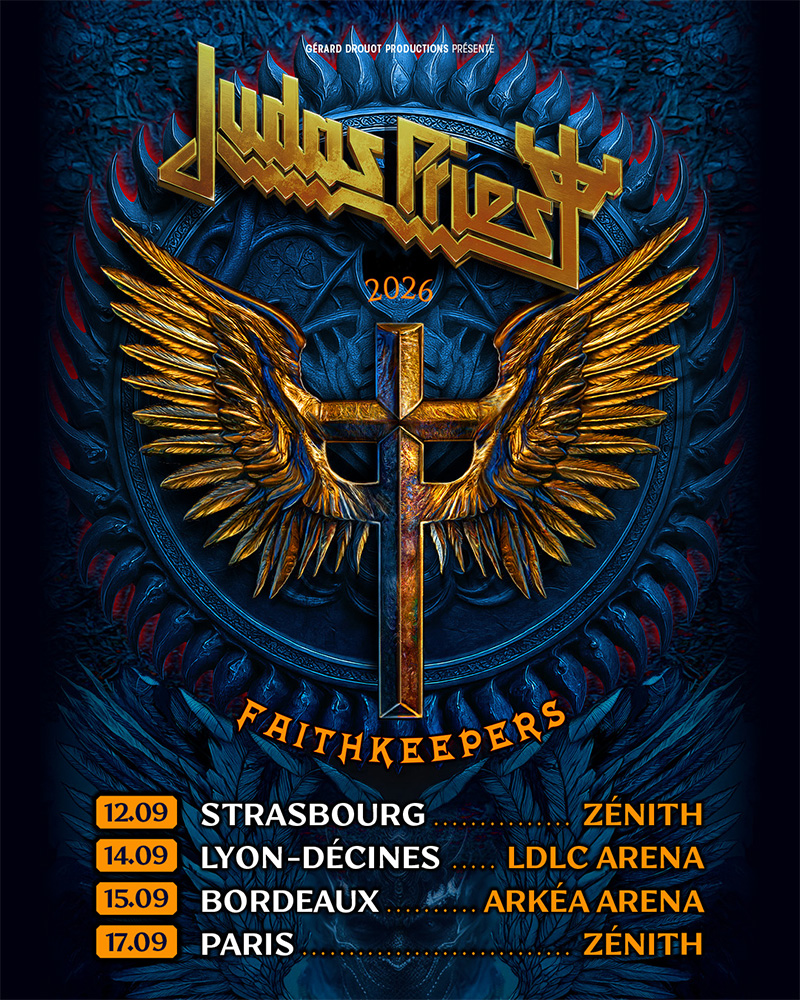

Les légendes britanniques du heavy metal annoncent leur retour dans l'Hexagone avec une série de concerts exceptionnels
entre août et septembre 2026.

Les amateurs de cuir clouté, de twin guitars et de cris surhumains peuvent marquer leur calendrier au feutre rouge : *
*Judas Priest** revient en France en 2026. Cinq dates au total — un festival et quatre salles majeures — dans le cadre
du **Faithkeepers Tour 2026**, la tournée européenne qui prolonge le cycle de leur dix-neuvième album studio,
*Invincible Shield*, sorti en mars 2024 et entré directement au 18ème rang du Billboard 200.

## Les dates françaises

{.mx-auto .d-block .mb-5 .mw-100}

Achetez vos billets sur [See Tickets](https://www.seetickets.com/fr/tg/tour/judas-priest/20740?P5136B95888FF1B5).

## Le Faithkeepers Tour : une tournée massive à travers l'Europe

Le passage français s'inscrit dans une tournée européenne d'envergure qui emmènera Judas Priest à travers l'Allemagne
(Wacken Open Air, BOBfest, Reload Festival), la Pologne, la République tchèque, la Slovaquie, les Pays-Bas, le
Royaume-Uni (Bloodstock Open Air), l'Espagne et la Belgique (Forest National à Bruxelles le 18 septembre, au lendemain
du Zénith de Paris). Le groupe avait déjà enchaîné 90 concerts en 2024 — un rythme qui le plaçait au quatrième rang des
artistes rock les plus actifs de l'année.

## Rob Halford, la voix qui refuse de s'éteindre

Si cette tournée suscite autant d'attente, c'est aussi parce que chaque concert de Judas Priest porte désormais le poids
de l'histoire — et de la résilience. **Rob Halford**, 75 ans en 2026, a traversé ces dernières années un combat contre
le cancer dont il est sorti victorieux. Sa voix, forcément différente de celle qui perçait les tympans sur *Painkiller*
en 1990, reste néanmoins reconnaissable entre toutes et capable de monter dans des registres que bien des chanteurs de
trente ans de moins ne toucheront jamais. Sa présence sur scène, nuit après nuit, relève autant de la performance
artistique que du symbole : le Metal God ne plie pas.

À ses côtés, le line-up actuel aligne **Richie Faulkner** et **Andy Sneap** aux guitares (le duo de six-cordes ayant
pris le relais du légendaire tandem Tipton/Downing), **Ian Hill** — seul membre fondateur encore en activité, bassiste
du groupe depuis 1969 — et **Scott Travis** à la batterie. Glenn Tipton, atteint de la maladie de Parkinson, reste
membre officiel du groupe et fait des apparitions ponctuelles sur scène lorsque sa santé le permet.

## *Invincible Shield* et un vingtième album en préparation

Le Faithkeepers Tour continue de porter *Invincible Shield*, accueilli très favorablement par la critique et les fans —
des titres comme *Panic Attack*, *Crown of Horns* et *Trial by Fire* ayant rejoint les classiques dans les setlists.
Mais le groupe ne compte pas s'arrêter là : Ian Hill a confirmé dans une interview récente que Judas Priest prévoit de
retourner en studio pour enregistrer ce qui serait leur **vingtième album**, Richie Faulkner ayant déjà accumulé un
nombre conséquent d'idées en tournée.

## Un passage par Carhaix avant les arenas

Le choix du **Motocultor Festival** à Carhaix le 16 août — un mois avant les dates en salle — est un clin d'œil bienvenu
à la scène festival française. Positionné comme l'un des rendez-vous metal incontournables de l'été breton, le
Motocultor offre à Judas Priest un cadre open air qui devrait donner une couleur particulière à cette première date
française de la tournée. Les quatre dates en salle qui suivent en septembre — Strasbourg, Lyon, Bordeaux, Paris —
permettront ensuite aux fans de vivre l'expérience Priest dans toute sa dimension scénique, avec la production complète
du Faithkeepers Tour.

## Plus de cinquante ans, et toujours debout

Fondé à Birmingham en 1969 — la même année que Black Sabbath, à quelques kilomètres de là —, Judas Priest a traversé
plus d'un demi-siècle sans jamais cesser de tourner ni de se réinventer. Plus de 50 millions d'albums vendus, cinq
disques de platine, une intronisation au **Rock and Roll Hall of Fame** en 2022, et une influence qui s'étend du thrash
au power metal en passant par la NWOBHM et le glam metal des années 80. Ils ont inventé l'imagerie du metal (cuir,
clous, motos), codifié le son (riffs tranchants, twin harmonies, voix stratosphérique) et survécu à toutes les modes.

En 2026, les Metal Gods reviennent en France rappeler une vérité simple : le heavy metal, quand il est joué par ceux qui
l'ont inventé, reste l'une des expériences live les plus puissantes qui existent.

Achetez vos billets sur [See Tickets](https://www.seetickets.com/fr/tg/tour/judas-priest/20740?P5136B95888FF1B5).
