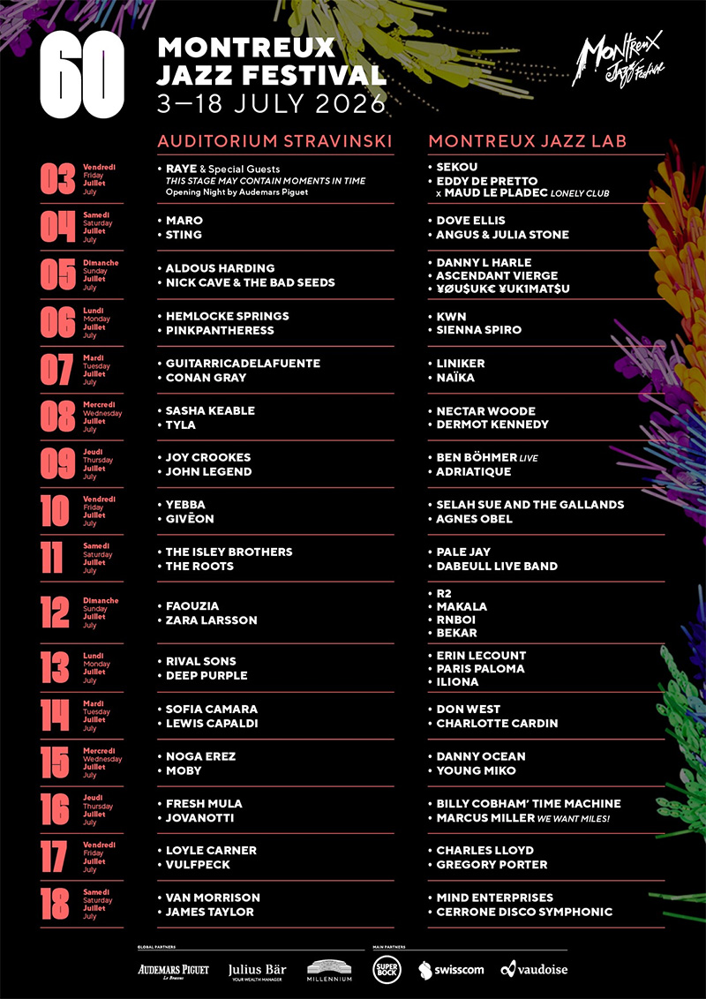

Soixante ans et aucun signe de lassitude. Le Montreux Jazz Festival a dévoilé ce mardi la programmation de son édition
anniversaire, et elle tient toutes ses promesses. Du 3 au 18 juillet 2026, les rives du Lac Léman accueilleront une
affiche vertigineuse où se croisent 22 nationalités, plusieurs générations de musiciens et tous les courants
imaginables — du jazz pur jus au hip-hop, de la pop éthérée au rock volcanique.

L'événement marque surtout le retour tant attendu dans le Centre des Congrès de Montreux, entièrement rénové. Après deux
éditions en plein air, le festival retrouve ses deux salles amirales : l'Auditorium Stravinski (4 621 places) et le
Montreux Jazz Lab (2 293 places). Les festivités s'accompagneront d'un tout nouveau club électro de 1 000 places, de
terrasses réaménagées et d'un parc de Vernex transformé en espace restaurant-plage — les artistes du club seront
annoncés en juin.

{.mx-auto .d-block .mb-5 .mw-100}

## RAYE en majesté pour ouvrir le bal

C'est RAYE qui aura l'honneur d'inaugurer cette 60e édition le 3 juillet, dans le cadre d'une soirée d'ouverture
spéciale co-créée avec Audemars Piguet. Pour l'occasion, l'Auditorium Stravinski sera reconfiguré dans une disposition
scénique inédite — une première dans l'histoire du festival. La chanteuse britannique aux racines suisses, récemment
couronnée aux Grammy Awards et forte de son nouvel album *This Music May Contain Hope*, viendra pour la troisième année
consécutive. Après une première apparition en 2024 dédiée à son grand-père helvétique et un deuxième passage qui avait
confirmé son envergure, ce troisième acte promet un concert sur mesure, avec plusieurs invités spéciaux.

Au Lab, le même soir, Eddy de Pretto ouvrira les hostilités avec *Lonely Club*, une création mêlant rap, musique et
danse contemporaine en collaboration avec la chorégraphe Maud Le Pladec.

> « C'est une année particulière pour le Montreux Jazz qui réintègre le Centre des congrès pour sa 60e édition
> anniversaire. »
> — **Mathieu Jaton**, directeur du festival

## Du rock au jazz : les légendes répondent présent

L'affiche réunit une constellation de noms qui incarnent à eux seuls l'histoire du festival. Sting, qui montera sur la
scène du Stravinski pour la huitième fois le 4 juillet, sera accompagné de la chanteuse portugaise Maro. Le 5 juillet,
Nick Cave & The Bad Seeds partageront l'affiche avec l'envoûtante Aldous Harding. Deep Purple, dont le légendaire *Smoke
On The Water* est né à Montreux même en 1971, revient le 13 juillet, précédé par Rival Sons. Et c'est Van Morrison —
vingt apparitions au compteur, record absolu — qui aura le privilège de clôturer l'édition le 18 juillet, aux côtés de
James Taylor.

Côté jazz, le festival déploie deux soirées de haut vol au Lab. Charles Lloyd, qui s'était produit lors de la toute
première édition en 1967, effectue un retour chargé de symboles à 88 ans. Marcus Miller rendra hommage à Miles Davis en
réunissant des musiciens du projet *We Want Miles!*, tandis que Billy Cobham et Gregory Porter complètent cette section
placée sous le signe de l'héritage.

## Pop, R&B et hip-hop : la nouvelle garde en force

Montreux 2026, c'est aussi une vitrine de la pop mondiale. PinkPantheress investira le Stravinski le 6 juillet, suivie
le lendemain par Conan Gray. Le 8, la Sud-Africaine Tyla — phénomène planétaire de l'afropop — fera ses débuts
montreusiens, quand John Legend et Lewis Capaldi assureront chacun leur soirée les 9 et 14 juillet. Zara Larsson,
Givēon, Yebba et Joy Crookes viennent muscler le versant R&B de l'affiche.

Le hip-hop ne sera pas en reste : The Roots, emmenés par Questlove, partageront l'affiche du 11 juillet avec les
intemporels Isley Brothers pour un plateau soul-funk-hip-hop de haute volée. Loyle Carner et Vulfpeck prendront le
relais le 17 juillet, tandis qu'une soirée rap francophone réunira au Lab R2, Makala, RnBoi et Bekar. Le pionnier du rap
italien Jovanotti, Moby — qui fera ses débuts à Montreux — et le duo électronique Adriatique complètent ce kaléidoscope.

La Canadienne Charlotte Cardin, l'Australienne Paris Paloma, la Franco-Suisse Iliona, la Brésilienne Liniker,
l'Israélienne Noga Erez, la Portoricaine Young Miko ou encore le Japonais ¥ØU$UK€ ¥UK1MAT$U illustrent l'ambition
internationale de cette édition, qui voit 22 pays de tous les continents représentés. Plus de quarante concerts seront
des exclusivités suisses.

Avec cette programmation à la croisée des styles, des continents et des générations, le Montreux Jazz Festival confirme
qu'à 60 ans, il reste l'un des rendez-vous musicaux les plus essentiels au monde — un lieu où le jazz dialogue encore
avec toutes les musiques, au bord d'un lac qui n'a rien perdu de sa magie.
