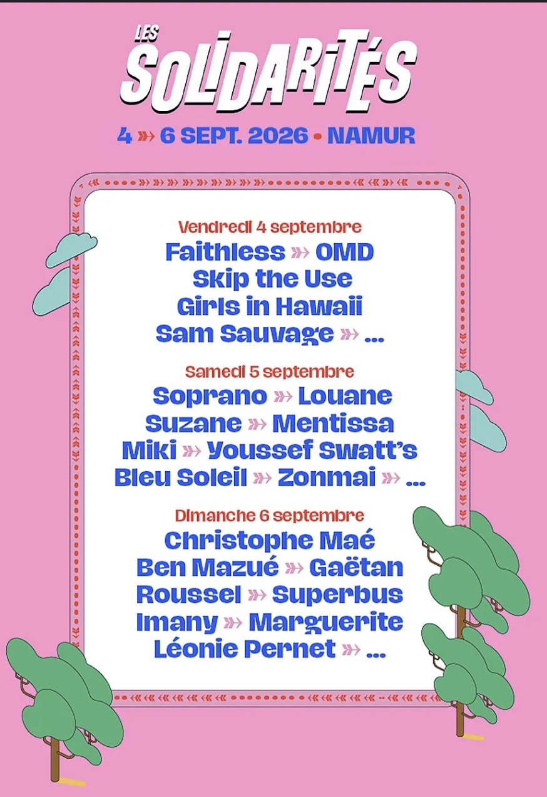

Du 4 au 6 septembre, le festival Les Solidarités fera son grand retour à Namur pour une 12ᵉ édition qui s’annonce une
nouvelle fois riche en musique, en rencontres et en convivialité.
Pendant trois jours, le public pourra profiter d’une programmation éclectique réunissant de nombreux artistes tels que
Skip The Use, Ben Mazué, Christophe Maé, Superbus, Faithless, Sam Sauvage, ainsi que bien d’autres, de quoi satisfaire
tous les amateurs de musique.

Au-delà des concerts, le festival met également en avant plusieurs espaces de vie. La Casa sera un véritable lieu de
rassemblement et d’échanges, accueillant concerts, animations et moments de convivialité tout au long du week-end. De
son côté, l’Urban Village proposera des démonstrations, des initiations et des animations autour des cultures urbaines,
offrant une expérience complémentaire à la programmation musicale.

Avec sa programmation variée, ses espaces d’échange et son ambiance chaleureuse, Les Solidarités s’imposent une nouvelle
fois comme l’un des rendez-vous incontournables de la rentrée en Belgique.

{.mx-auto .d-block .mb-5 .mw-100}
