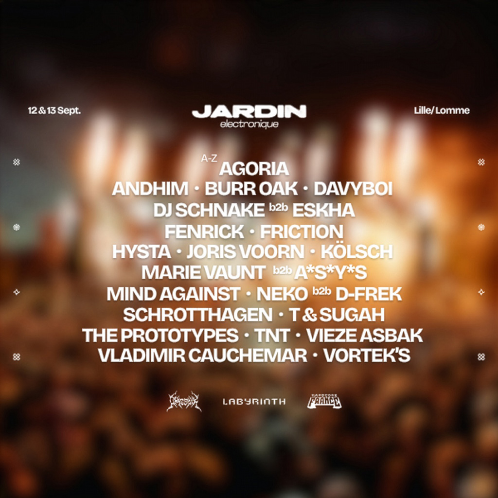

Les 12 et 13 septembre 2026, le Jardin Électronique fait son grand retour au Parc Naturel Urbain de Lomme, près de
Lille, pour un week-end entièrement dédié aux musiques électroniques. Devenu un rendez-vous incontournable dans les
Hauts-de-France, le festival réunit chaque année des milliers de festivaliers autour d’une programmation mêlant artistes
internationaux, talents émergents et scénographie immersive.

Le festival se déploiera sur quatre scènes : l’Arène, l’Eden, le Dôme et le Lac, offrant chacune une ambiance unique.
Les 50 artistes programmés se succéderont tout au long du week-end et seront répartis selon quatre univers musicaux,
appelés Tribus.

La Tribu Tech réunira les amateurs de techno, trance, hard trance, acid et bounce. La Tribu Hard mettra à l’honneur la
hard techno, l’indus, la schranz, le hardcore, la frenchcore, le hardstyle et l’uptempo. La Tribu Melo explorera des
sonorités plus mélodiques avec de la tech house, de la minimal, de la deep house, de la melodic techno et de l’afro
house. Enfin, la Tribu Bass fera la part belle à la drum & bass, la neurofunk, le jump up, le dubstep, la dancefloor et
la liquid.

Parmi les artistes les plus attendus de cette édition figurent notamment Joris Voorn, Agoria, Kölsch, Mind Against,
Vladimir Cauchemar, Andhim, Marie Vaunt b2b ASY*S, Hysta, TNT, Burr Oak et The Prototypes.

Entre performances de haut niveau, scénographie soignée, installations artistiques et ambiance festive, le Jardin
Électronique 2026 promet une nouvelle fois une expérience immersive où musique, nature et partage se rencontrent au cœur
de la métropole lilloise.

{.mx-auto .d-block .mb-5 .mw-100}
