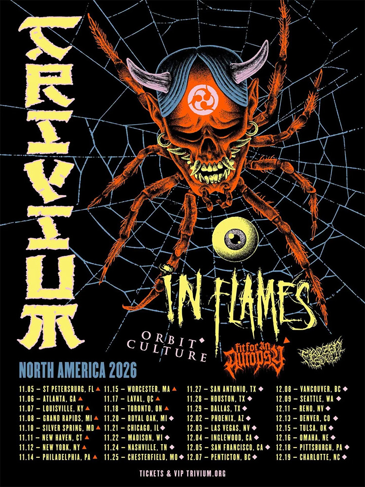

**Trivium** a dévoilé une tournée nord-américaine de trente-deux dates cet automne, du 5 novembre à Saint-Pétersbourg
(Floride) au 19 décembre à Charlotte (Caroline du Nord), entouré d'**In Flames**, **Frozen Soul**, **Orbit Culture**
et **Fit For An Autopsy**.

###### In Flames et Frozen Soul du début à la fin

**In Flames** et **Frozen Soul** accompagnent Trivium sur l'intégralité des trente-deux dates, qui traversent le
continent via New York, Toronto, Chicago, Dallas, Las Vegas, San Francisco, Seattle et Denver. **Orbit Culture**
assure les onze premières dates, avant de laisser place à **Fit For An Autopsy** pour les vingt et une dernières.

###### Premier tour majeur avec Alex Rüdinger à la batterie

Présentée comme le début non officiel d'une nouvelle ère pour le groupe, la tournée est aussi la première grande
tournée nord-américaine avec le batteur **Alex Rüdinger**, arrivé en 2025. Trivium devrait y interpréter des
premiers titres de son prochain album studio.

La prévente a débuté le 21 juillet à midi (heure de l'Est) avec le code CROWN, avant la mise en vente générale
vendredi à 10 heures (heure locale).

{.mx-auto .d-block .mb-5 .mw-100}
