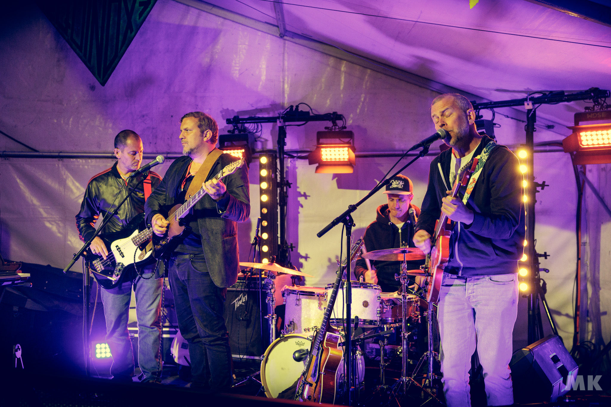
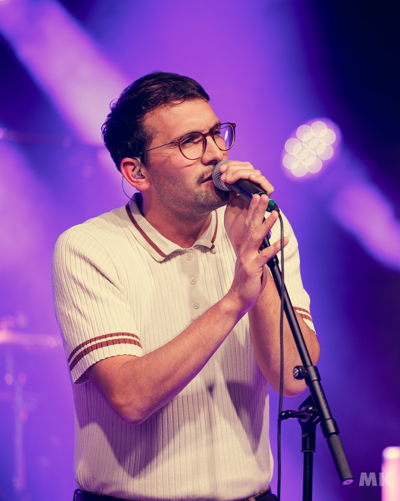
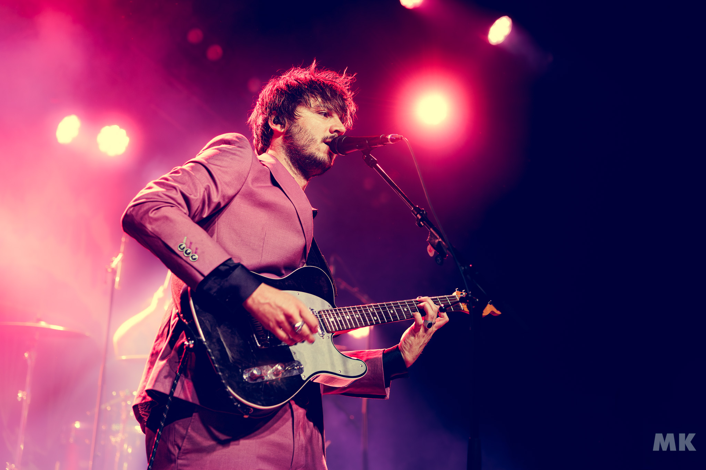
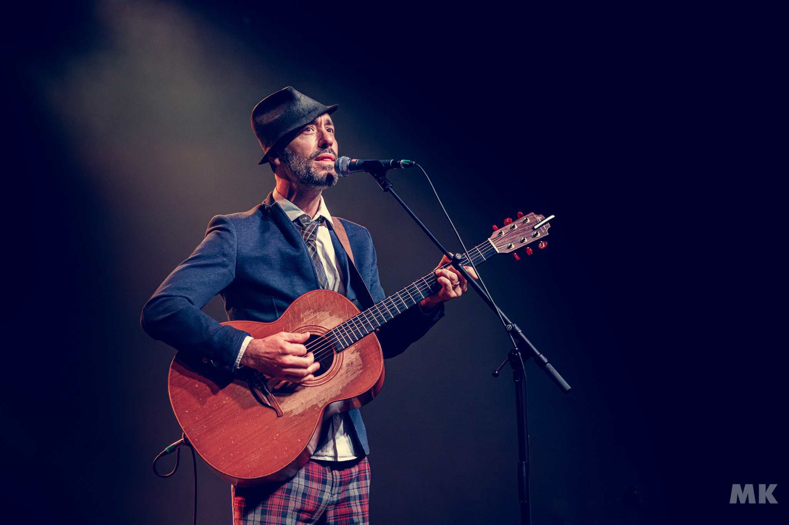

C’est sous un ciel capricieux que s’ouvre la deuxième soirée du Poprock Festival.

Il y à beaucoup plus de monde que la veille, surement le genre musical plus accessible que le métal pour la plupart des
gens, et notamment plus de famille.

Tendinista ouvre les festivités, leur rock psychédélique, teinté de pop a créé un groove envoûtant qui a rapidement
réchauffé l’atmosphère.

Le quatuor nyonnais, avec ses polyrythmies élégantes et ses sonorités dépouillées, a captivé le public.

Leur performance, notamment sur le morceau « Nothing to Talk About », a réussi à embarquer l'auditoire dans leur
univers.

Une ouverture parfaite pour lancer la soirée sur une note mélodique et immersive.

Le groupe biennois The Clive a ensuite pris le relais, injectant une dose massive d'énergie rock.

Leur performance explosive est marquée par une présence scénique charismatique et une interaction dynamique avec le
public.

Le guitariste, véritable showman, a enflammé la scène avec des solos abrasifs et un enthousiasme contagieux.

Fidèles à leur réputation, The Clive a livré un rock vibrant, dans la lignée des meilleures formations anglaises,
transformant la scène en une véritable fête endiablée.

Une performance mémorable qui a su repousser les limites et captiver les fans, anciens comme nouveaux.

La scène a ensuite été secouée par Storm Orchestra, dont le rock moderne, soutenu par des riffs puissants et des
refrains accrocheurs, a immédiatement capté l'attention.

Inspiré par des groupes comme Royal Blood et Muse, le power trio a délivré une énergie brute et sans concession.

Les rythmes effrénés et les gimmicks percutants ont maintenu la tension à son comble, culminant avec leur tube «
Suspect » qui a fait vibrer la foule.

Storm Orchestra a prouvé une fois de plus pourquoi ils sont en pleine ascension sur la scène rock actuelle.

La soirée s’est conclue de manière magistrale avec Charlie Winston, dont le set solo a été un véritable moment de grâce.

Armé de sa guitare et de son piano, il a envoûté le public avec sa voix chaleureuse et son charisme incomparable.
Alternant ses morceaux introspectifs, fruits d'une collaboration avec Vianney, et ses titres hits, comme « Like a
Hobo », sa musique résonne avec une profondeur émotionnelle rare, créant une ambiance intime et complice.

Un final en apothéose pour une journée riche en émotions.

La seconde journée du Poprock Festival, malgré les averses torrentielles, a été une véritable réussite, démontrant
encore une fois la diversité et la qualité de la programmation.
