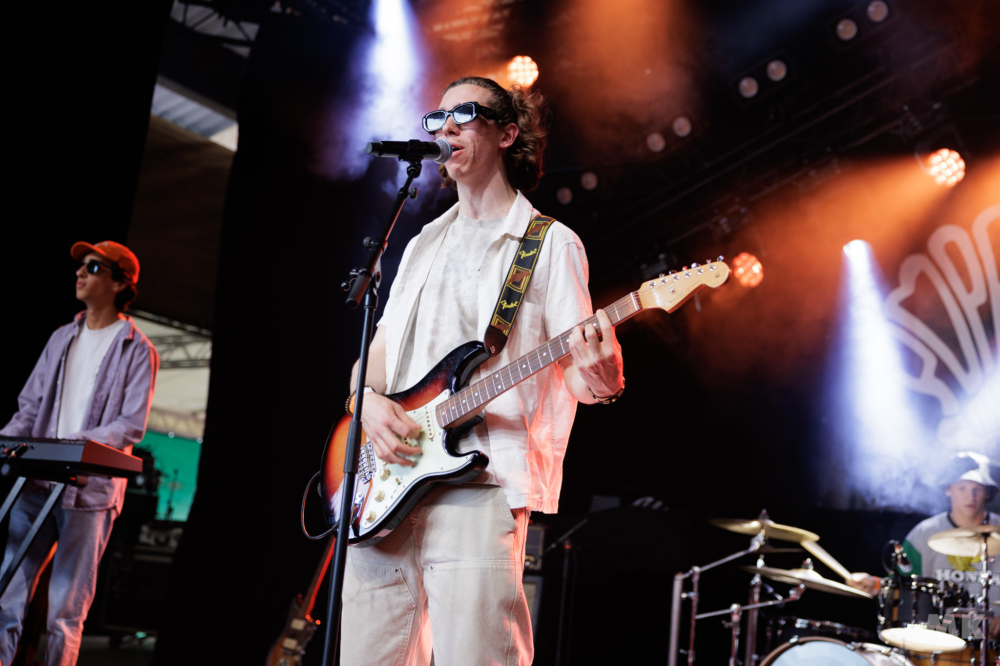
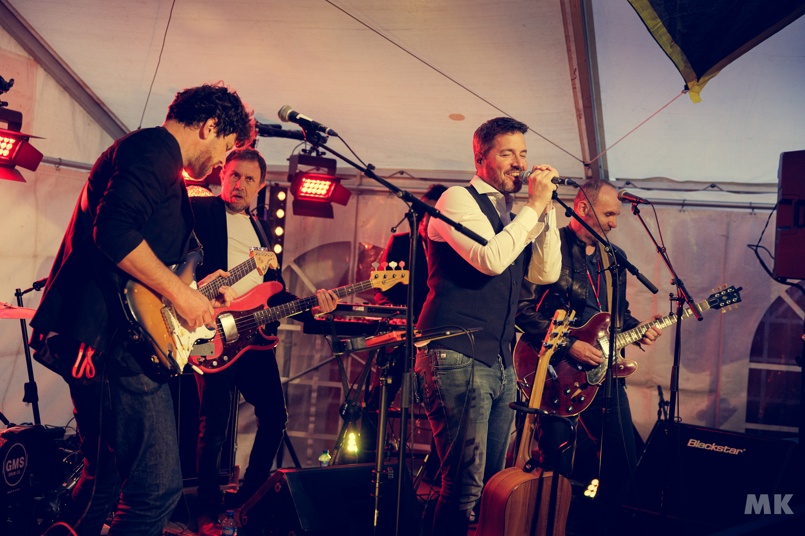
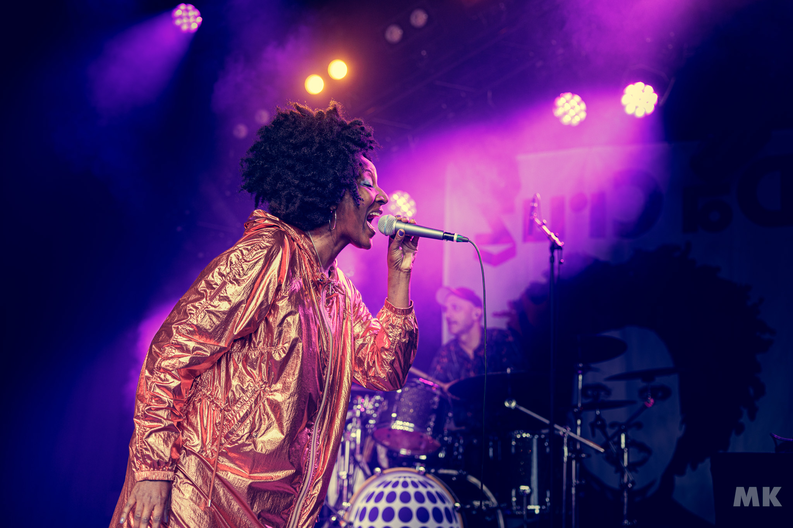
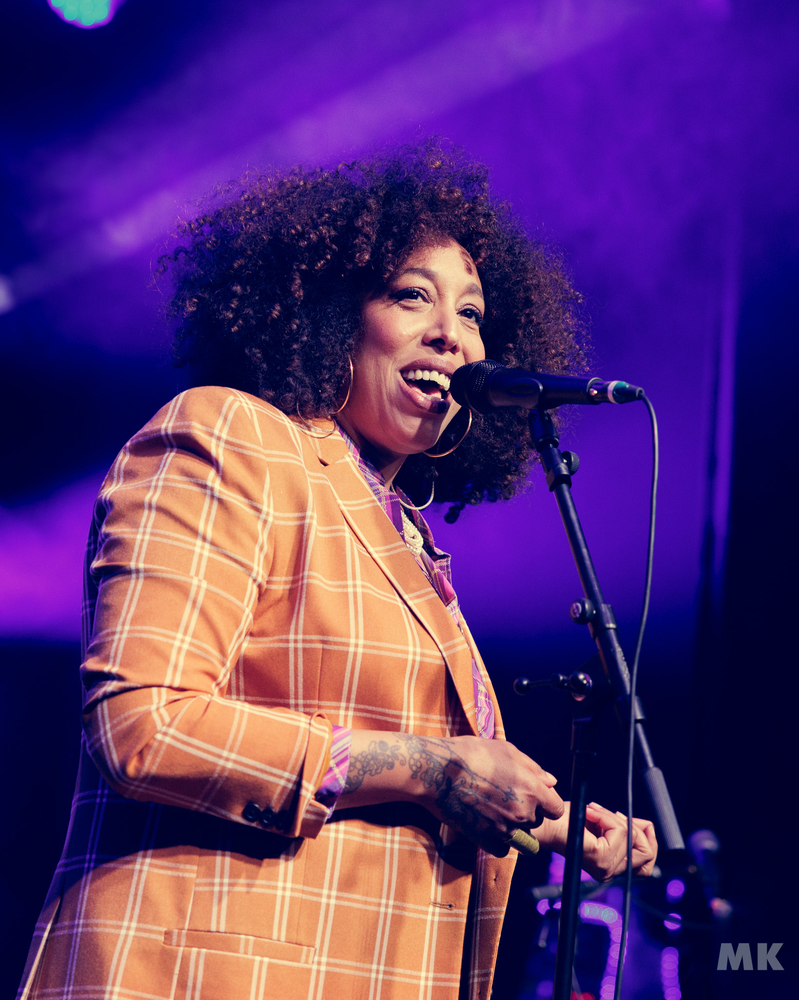
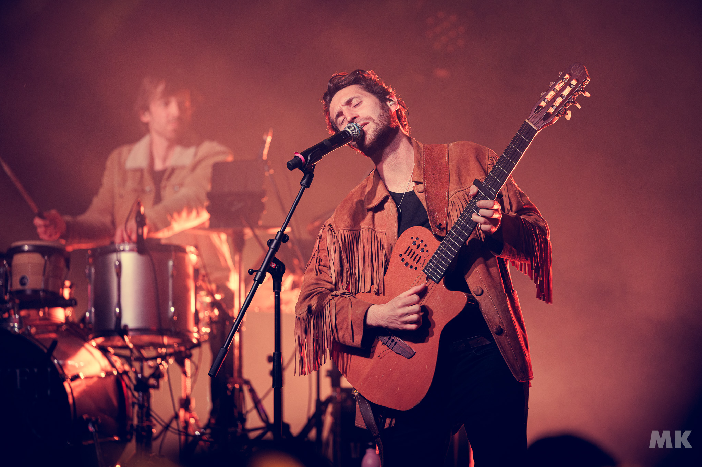

Les gagnants du concours jeune talent, The Square, ont ouvert les festivités avec une énergie rafraîchissante.

Malgré une mise en scène encore débutante, le groupe a montré une volonté et un investissement notables.

Leur musique, agréable et bien exécutée, a particulièrement brillé avec leur reprise de "Californication" des Red Hot
Chili Peppers, mettant en avant un bassiste captivé et captivant.

L'interaction avec le public était dynamique, bien que ce dernier soit encore peu nombreux à ce moment de la journée.

Une performance prometteuse pour ce jeune groupe.

Dans une ambiance plus aérienne et introspective, My Beautiful Disorders a proposé un set qui, bien que de grande
qualité, a eu du mal à captiver un public déjà habitué à des rythmes plus dynamiques.

Leur rock électro 80’s et atmosphérique, bien exécuté, n'a pas réussi à maintenir l'engagement des festivaliers, malgré
des riffs soignés et une profondeur musicale notable.

Une prestation peut-être mal placée dans la programmation, mais qui a tout de même apporté une belle diversité musicale
à la soirée.

Mariana Da Cruz, une véritable tornade brésilienne, a enflammé la scène avec sa présence exubérante et sa voix
chaleureuse.

Son mélange unique de bossa nova, hip-hop et électro a fait danser le public dès les premières notes.

Avec "Liberdade", elle a démontré une capacité exceptionnelle à engager et enthousiasmer la foule.

Mariana est même descendue au milieu du public, créant une connexion intime et festive.

Une performance énergique et colorée.

Da Break a ensuite apporté une dose massive de groove et de chaleur avec leur mélange de soul, hip-hop, R’n’B et funk.

La voix puissante et douce d'Hawa a porté le groupe à des sommets d'énergie et de virtuosité.

Leur set, comprenant des reprises de classiques comme "My Name Is" d'Eminem et "In Da Club" de 50 Cent, a enflammé la
scène et le public.

Chaque membre du quintet a brillé, démontrant une parfaite alchimie et une présence scénique irrésistible.

Da Break a transformé le festival en une immense piste de danse, impossible de résister à leur invitation.

Pour clore cette dernière journée, Broken Back a littéralement mis le feu au Poprock Festival.

L'artiste de Saint-Malo a charmé le public avec sa pop lumineuse et sa voix tendre et éraillée.

Alternant entre guitare et piano, il a démontré une aisance et une connexion exceptionnelle avec ses fans.

Le set, soutenu par un bassiste et un batteur remplaçant mais talentueux, a culminé en un moment de communion musicale
intense, avec le public chantant et dansant en harmonie.

Une fin en apothéose pour un festival riche en émotions et découvertes.

Cette dernière journée du Poprock Festival a été un tourbillon d'émotions et de styles musicaux, confirmant le festival
comme un rendez-vous incontournable pour les amateurs de musique en tout genre.
